assign temperature range assertions, like would be found in local/flattened_n4l_temperature_components.tsv, agaisnt the minimum and maximum boundaries in metpo.owl

```sparql
PREFIX metpo: <https://w3id.org/metpo/>
PREFIX rdfs: <http://www.w3.org/2000/01/rdf-schema#>
select
distinct ?s ?l ?min ?max
where {
    values ?o  {
        metpo:1000147 metpo:1000217
    }
    ?s rdfs:subClassOf+ ?o ;
    rdfs:label ?l ;
    metpo:Unit "C" . # THERE ARE A FEW UNITLESS ASSERTIONS TOO
    optional {
        ?s metpo:RangeMax ?max
    }
    optional {
        ?s metpo:RangeMin ?min
    }
}
order by ?l
```

> Showing results from 0 to 30 of 30. Query took 0.1s, moments ago.

s | l | min | max
-- | -- | -- | --
https://w3id.org/metpo/1000339 | extreme hyperthermophile | 90 | 125
https://w3id.org/metpo/1000338 | extreme thermophile | 60 | 80
https://w3id.org/metpo/1000161 | hyperthermophile | 80 | 115
https://w3id.org/metpo/1000181 | mesophile | 20 | 45
https://w3id.org/metpo/1000259 | psychrophile | 0 | 20
https://w3id.org/metpo/1000336 | psychrotolerant | 0 | 45
https://w3id.org/metpo/1000303 | temperature delta |   |  
https://w3id.org/metpo/1000487 | temperature delta high | 30 |  
https://w3id.org/metpo/1000484 | temperature delta low | 5 | 10
https://w3id.org/metpo/1000485 | temperature delta mid1 | 10 | 20
https://w3id.org/metpo/1000486 | temperature delta mid2 | 20 | 30
https://w3id.org/metpo/1000483 | temperature delta very low | 1 | 5
https://w3id.org/metpo/1000329 | temperature optimum |   |  
https://w3id.org/metpo/1000447 | temperature optimum high | 40 |  
https://w3id.org/metpo/1000442 | temperature optimum low | 10 | 22
https://w3id.org/metpo/1000443 | temperature optimum mid1 | 22 | 27
https://w3id.org/metpo/1000444 | temperature optimum mid2 | 27 | 30
https://w3id.org/metpo/1000445 | temperature optimum mid3 | 30 | 34
https://w3id.org/metpo/1000446 | temperature optimum mid4 | 34 | 40
https://w3id.org/metpo/1000441 | temperature optimum very low |   | 10
https://w3id.org/metpo/1000330 | temperature range |   |  
https://w3id.org/metpo/1000454 | temperature range high | 40 |  
https://w3id.org/metpo/1000449 | temperature range low | 10 | 22
https://w3id.org/metpo/1000450 | temperature range mid1 | 22 | 27
https://w3id.org/metpo/1000451 | temperature range mid2 | 27 | 30
https://w3id.org/metpo/1000452 | temperature range mid3 | 30 | 34
https://w3id.org/metpo/1000453 | temperature range mid4 | 34 | 40
https://w3id.org/metpo/1000448 | temperature range very low |   | 10
https://w3id.org/metpo/1000308 | thermophile | 45 | 80
https://w3id.org/metpo/1000337 | thermotolerant | 0 | 50

Doesn't include facultative psychrophile (0-30?) from KG microbe yet


N4L temperature predicates, after normalization by

- metpo/n4l_tables_to_quads.ipynb -> local/n4l-tables.nq -> multiple GrapDB named graphs
    - see also assets/n4l_predicate_mapping_normalization.csv
- sparql/temperature_query.rq -> local/n4l-temperature.csv
- metpo/classify_temperature_values.ipynb -> local/n4l-temperature.ttl and local/n4l-temperature-un-parsed.csv
- sparql/flatten_n4l_parsing_components.rq -> local/flattened_n4l_temperature_components.tsv


* <http://example.com/n4l/temperature>
    * handled by metpo/classify_temperature_values.ipynb, sparql/report_parsed_temperature_categories.rq
* <http://example.com/n4l/temperature_(grows)>
* <http://example.com/n4l/temperature_optimum>
* <http://example.com/n4l/temperature_range>
* <http://example.com/n4l/temperature_(does_not_grow)>

What can be inferred from another temperature assertion?

* Delta can always be calculated from the range.
* Range can be inferred from delta plus one limit (min or max).
* Optimum is generally measured, not inferred.
* Categorical labels are assigned based on optimum (and sometimes range).
* Psychrotolerant/thermotolerant specifically require both optimum and range for accurate assignment.


```python
import os
import re
import xml.dom.minidom
from typing import List, Tuple, Dict, Optional

import matplotlib.pyplot as plt
import numpy as np
import pandas as pd
```


```python
PROTOLOG_DIR = "../assets/N4L_phenotypic_ontology_2016/extracted_protologs_2013/protologs"
protologs_set = set(os.listdir(PROTOLOG_DIR))
```


```python
observations_df = pd.read_csv('../assets/flattened_n4l_temperature_components_manually_filtered_quantitative.tsv',
                              sep='\t')
```


```python
# Load inputs
classes_df = pd.read_csv('../assets/metpo-temperature-ranges-of-classes.csv')

```


```python
# Clean class definitions
classes_df = classes_df.rename(columns={
    "s": "class_iri",
    "l": "class_label",
    "min": "class_min",
    "max": "class_max"
})
```


```python
observations_df = observations_df.rename(columns=lambda c: c.lstrip('?'))
```


```python
for col in ['minimum_value', 'maximum_value', 'spot_value']:
    observations_df[col] = pd.to_numeric(observations_df[col], errors='coerce')

```


```python
# Remove angle brackets for subject matching
observations_df['subject'] = observations_df['subject'].str.strip('<>')
observations_df['predicate'] = observations_df['predicate'].str.strip('<>')

```


```python
# Convert numeric values if not done already
for col in ['minimum_value', 'maximum_value', 'spot_value']:
    observations_df[col] = pd.to_numeric(observations_df[col], errors='coerce')

```

may want to add facultative psychrophile to match KG-Microbe


```python
# -----------------------------------------------
# Define class groupings
# -----------------------------------------------

# Group 1: growth category classes (e.g., thermophile)
growth_classes = classes_df[classes_df['class_label'].isin([
    "psychrophile", "psychrotolerant", "mesophile",
    "thermotolerant", "thermophile", "hyperthermophile",
    "extreme thermophile", "extreme hyperthermophile"
])].copy()
```


```python
# Group 2: temperature optimum and range subclasses
subrange_classes = classes_df[classes_df['class_label'].str.startswith("temperature optimum") |
                              classes_df['class_label'].str.startswith("temperature range")].copy()

```


```python
# Group 3: delta range classes
delta_classes = classes_df[classes_df['class_label'].str.startswith("temperature delta")].copy()

```


```python
# Count non-null values across minimum, maximum, spot (melted)
observation_counts = (
    observations_df[['subject', 'minimum_value', 'maximum_value', 'spot_value']]
    .melt(id_vars='subject', value_name='value')
    .dropna(subset=['value'])
    .groupby('subject')
    .size()
    .reset_index(name='observation_count')
)

# Count unique predicates per subject
predicate_counts = (
    observations_df[['subject', 'predicate']]
    .drop_duplicates()
    .groupby('subject')
    .size()
    .reset_index(name='predicate_count')
)

# ✅ Merge them into one DataFrame
summary = pd.merge(observation_counts, predicate_counts, on='subject', how='outer').fillna(0)
summary['observation_count'] = summary['observation_count'].astype(int)
summary['predicate_count'] = summary['predicate_count'].astype(int)

summary['magnitude'] = np.sqrt(summary['observation_count'] ** 2 + summary['predicate_count'] ** 2)
```


```python
PREDICATE_COLORS = {
    'temperature_optimum': 'green',
    'temperature_range': 'yellow',
    'temperature_(grows)': 'orange',
    'temperature_(does_not_grow)': 'red'
}

```


```python
def get_predicate_color(predicate_iri):
    short = predicate_iri.split('/')[-1]
    return PREDICATE_COLORS.get(short, 'gray')
```


```python

def plot_temperature_profile(subject_id=None, observations_df=None, classes_df=None):
    has_obs = observations_df is not None and subject_id is not None
    has_classes = classes_df is not None

    if not has_obs and not has_classes:
        raise ValueError("Must provide at least a subject + observations_df or a classes_df.")

    fig, ax = plt.subplots(figsize=(10, 6))
    y_labels = []
    y_positions = []
    y_pos = 0

    # === Plot subject observations ===
    if has_obs:
        sub = observations_df[observations_df['subject'] == subject_id].copy()
        if sub.empty:
            print(f"No observations found for subject: {subject_id}")
        else:
            spot_agg = (
                sub[pd.notnull(sub['spot_value'])]
                .groupby(['predicate', 'spot_value'])
                .size()
                .reset_index(name='count')
            )

            for pred_short in reversed(PREDICATE_COLORS):
                full_preds = [p for p in sub['predicate'].unique() if p.endswith(pred_short)]
                for pred in full_preds:
                    color = get_predicate_color(pred)

                    # Spot values
                    spots = spot_agg[spot_agg['predicate'] == pred]
                    if not spots.empty:
                        for _, row in spots.iterrows():
                            ax.scatter(row['spot_value'], y_pos, color=color,
                                       s=30 + 20 * row['count'], zorder=5)
                        y_labels.append(f"{pred_short} (spot)")
                        y_positions.append(y_pos)
                        y_pos += 1

                    # Range values
                    ranges = sub[
                        (sub['predicate'] == pred) &
                        pd.notnull(sub['minimum_value']) &
                        pd.notnull(sub['maximum_value'])
                        ]
                    if not ranges.empty:
                        range_group = (
                            ranges.groupby(['minimum_value', 'maximum_value'])
                            .size()
                            .reset_index(name='count')
                        )
                        for _, row in range_group.iterrows():
                            ax.plot([row['minimum_value'], row['maximum_value']], [y_pos, y_pos],
                                    color=color, lw=1 + row['count'], alpha=0.6)
                            ax.scatter([row['minimum_value'], row['maximum_value']], [y_pos, y_pos],
                                       color=color, s=20 + 10 * row['count'])
                        y_labels.append(f"{pred_short} (range)")
                        y_positions.append(y_pos)
                        y_pos += 1

    # === Plot target classes ===
    if has_classes:
        class_df = classes_df[
            ~classes_df['class_label'].str.startswith("temperature delta")
        ].copy()

        # Sorting keys
        class_df['sort_min'] = class_df['class_min'].fillna(-np.inf)
        class_df['sort_max'] = class_df['class_max'].fillna(np.inf)

        # Grouping logic
        is_range = class_df['class_label'].str.contains("temperature range", case=False)
        is_optimum = class_df['class_label'].str.contains("temperature optimum", case=False)

        df_range = class_df[is_range].sort_values(by=['sort_min', 'sort_max'])
        df_optimum = class_df[is_optimum & ~is_range].sort_values(by=['sort_min', 'sort_max'])
        df_other = class_df[~is_range & ~is_optimum].sort_values(by=['sort_min', 'sort_max'])

        sorted_class_df = pd.concat([df_range, df_optimum, df_other], ignore_index=True)

        for _, row in sorted_class_df.iterrows():
            label = row['class_label']
            min_val = row['class_min']
            max_val = row['class_max']
            cy = y_pos

            if pd.notnull(min_val) and pd.notnull(max_val):
                ax.plot([min_val, max_val], [cy, cy], color='black', lw=2)
                ax.scatter([min_val, max_val], [cy, cy], color='black', zorder=5)
            elif pd.notnull(min_val) and pd.isnull(max_val):
                ax.text(min_val, cy, '▶', fontsize=12, ha='left', va='center', color='black')
            elif pd.notnull(max_val) and pd.isnull(min_val):
                ax.text(max_val, cy, '◀', fontsize=12, ha='right', va='center', color='black')

            y_labels.append(label)
            y_positions.append(cy)
            y_pos += 1

    # === Final layout ===
    if y_labels:
        ax.set_yticks(y_positions)
        ax.set_yticklabels(y_labels)

    ax.set_xlabel("Temperature (°C)")
    title = "Temperature Profile"
    if subject_id:
        title += f" for {subject_id}"
    ax.set_title(title)
    ax.grid(True)
    plt.tight_layout()
    plt.show()

```


```python

def assign_temperature_classes_advanced(
        subject_id,
        observations_df,
        classes_df,
        overlap_threshold=0.5,
        return_all_matches=True
):
    def get_range(row):
        if pd.notnull(row.get("minimum_value")) and pd.notnull(row.get("maximum_value")):
            return row["minimum_value"], row["maximum_value"]
        elif pd.notnull(row.get("spot_value")):
            return row["spot_value"], row["spot_value"]
        else:
            return None

    obs = observations_df[observations_df["subject"] == subject_id]
    if obs.empty:
        return pd.DataFrame()

    predicate_intervals = {
        "temperature_optimum": [],
        "temperature_range": [],
        "temperature_(grows)": [],
        "temperature_(does_not_grow)": []
    }

    for _, row in obs.iterrows():
        predicate = row["predicate"].split("/")[-1]
        if predicate in predicate_intervals:
            r = get_range(row)
            if r:
                predicate_intervals[predicate].append(r)

    all_positive_ranges = predicate_intervals["temperature_range"] + predicate_intervals["temperature_(grows)"] + \
                          predicate_intervals["temperature_optimum"]
    if all_positive_ranges:
        min_temp = min(r[0] for r in all_positive_ranges)
        max_temp = max(r[1] for r in all_positive_ranges)
        delta = max_temp - min_temp
    else:
        delta = None

    def tag_class_group(label):
        if "delta" in label.lower():
            return "delta"
        elif "range" in label.lower():
            return "range"
        elif "optimum" in label.lower():
            return "optimum"
        else:
            return "categorical"

    results = []
    class_df = classes_df.copy()
    class_df["group"] = class_df["class_label"].apply(tag_class_group)
    class_df["span"] = class_df["class_max"].fillna(np.inf) - class_df["class_min"].fillna(-np.inf)

    for _, cls in class_df.iterrows():
        label = cls["class_label"]
        iri = cls.get("class_iri")
        group = cls["group"]
        cmin = cls["class_min"] if pd.notnull(cls["class_min"]) else -np.inf
        cmax = cls["class_max"] if pd.notnull(cls["class_max"]) else np.inf
        span = cls["span"]

        matched = False
        excluded = False
        matched_range = None
        overlap_fraction = 0

        if group == "optimum":
            candidates = predicate_intervals["temperature_optimum"]
        elif group in ["range", "categorical"]:
            candidates = predicate_intervals["temperature_range"] + predicate_intervals["temperature_(grows)"]
        elif group == "delta" and delta is not None:
            if cmin <= delta <= cmax:
                matched = True
                matched_range = (delta, delta)
                overlap_fraction = 1.0
        else:
            candidates = []

        for rmin, rmax in candidates:
            overlap_min = max(cmin, rmin)
            overlap_max = min(cmax, rmax)
            overlap_len = max(0, overlap_max - overlap_min)
            rlen = max(1e-6, rmax - rmin)
            frac = overlap_len / rlen
            if frac >= overlap_threshold:
                matched = True
                matched_range = (rmin, rmax)
                overlap_fraction = frac
                break

        if matched and group != "delta":
            for rmin, rmax in predicate_intervals["temperature_(does_not_grow)"]:
                if max(cmin, rmin) < min(cmax, rmax):
                    excluded = True
                    break

        if matched:
            results.append({
                "subject": subject_id,
                "class_label": label,
                "class_iri": iri,
                "class_group": group,
                "assignment": "match" if not excluded else "excluded",
                "source_range": matched_range,
                "class_range": (cmin, cmax),
                "overlap_fraction": overlap_fraction,
                "class_span": span
            })

    result_df = pd.DataFrame(results)
    if not return_all_matches:
        final = []
        for group in result_df["class_group"].unique():
            subset = result_df[(result_df["class_group"] == group) & (result_df["assignment"] == "match")]
            if not subset.empty:
                final.append(subset.loc[subset["class_span"].idxmin()])
        return pd.DataFrame(final)

    return result_df

```


```python
assignments = assign_temperature_classes_advanced(
    "http://example.com/n4l/rid.2547_nm.11491",
    observations_df,
    classes_df,
    overlap_threshold=0.9,
    return_all_matches=True
)
```


```python
unique_subjects = observations_df['subject'].unique()
```


```python
assignments = pd.concat([
    assign_temperature_classes_advanced(
        subject_id=subj,
        observations_df=observations_df,
        classes_df=classes_df,
        overlap_threshold=0.9,
        return_all_matches=True
    )
    for subj in unique_subjects
], ignore_index=True)
```


```python
assignments
```


<div>
<style scoped>
    .dataframe tbody tr th:only-of-type {
        vertical-align: middle;
    }

    .dataframe tbody tr th {
        vertical-align: top;
    }

    .dataframe thead th {
        text-align: right;
    }
</style>
<table border="1" class="dataframe">
  <thead>
    <tr style="text-align: right;">
      <th></th>
      <th>subject</th>
      <th>class_label</th>
      <th>class_iri</th>
      <th>class_group</th>
      <th>assignment</th>
      <th>source_range</th>
      <th>class_range</th>
      <th>overlap_fraction</th>
      <th>class_span</th>
    </tr>
  </thead>
  <tbody>
    <tr>
      <th>0</th>
      <td>http://example.com/n4l/nm.10206</td>
      <td>mesophile</td>
      <td>https://w3id.org/metpo/1000181</td>
      <td>categorical</td>
      <td>match</td>
      <td>(22.0, 28.0)</td>
      <td>(20.0, 45.0)</td>
      <td>1.0</td>
      <td>25.0</td>
    </tr>
    <tr>
      <th>1</th>
      <td>http://example.com/n4l/nm.10206</td>
      <td>psychrotolerant</td>
      <td>https://w3id.org/metpo/1000336</td>
      <td>categorical</td>
      <td>match</td>
      <td>(22.0, 28.0)</td>
      <td>(0.0, 45.0)</td>
      <td>1.0</td>
      <td>45.0</td>
    </tr>
    <tr>
      <th>2</th>
      <td>http://example.com/n4l/nm.10206</td>
      <td>temperature delta mid2</td>
      <td>https://w3id.org/metpo/1000486</td>
      <td>delta</td>
      <td>match</td>
      <td>(22.0, 28.0)</td>
      <td>(20.0, 30.0)</td>
      <td>1.0</td>
      <td>10.0</td>
    </tr>
    <tr>
      <th>3</th>
      <td>http://example.com/n4l/nm.10206</td>
      <td>thermotolerant</td>
      <td>https://w3id.org/metpo/1000337</td>
      <td>categorical</td>
      <td>match</td>
      <td>(22.0, 28.0)</td>
      <td>(0.0, 50.0)</td>
      <td>1.0</td>
      <td>50.0</td>
    </tr>
    <tr>
      <th>4</th>
      <td>http://example.com/n4l/nm.10208</td>
      <td>temperature delta mid1</td>
      <td>https://w3id.org/metpo/1000485</td>
      <td>delta</td>
      <td>match</td>
      <td>(16.0, 16.0)</td>
      <td>(10.0, 20.0)</td>
      <td>1.0</td>
      <td>10.0</td>
    </tr>
    <tr>
      <th>...</th>
      <td>...</td>
      <td>...</td>
      <td>...</td>
      <td>...</td>
      <td>...</td>
      <td>...</td>
      <td>...</td>
      <td>...</td>
      <td>...</td>
    </tr>
    <tr>
      <th>3420</th>
      <td>http://example.com/n4l/rid.9953_nm.14934</td>
      <td>temperature delta high</td>
      <td>https://w3id.org/metpo/1000487</td>
      <td>delta</td>
      <td>match</td>
      <td>(46.0, 46.0)</td>
      <td>(30.0, inf)</td>
      <td>1.0</td>
      <td>inf</td>
    </tr>
    <tr>
      <th>3421</th>
      <td>http://example.com/n4l/rid.9953_nm.14934</td>
      <td>thermotolerant</td>
      <td>https://w3id.org/metpo/1000337</td>
      <td>categorical</td>
      <td>match</td>
      <td>(4.0, 50.0)</td>
      <td>(0.0, 50.0)</td>
      <td>1.0</td>
      <td>50.0</td>
    </tr>
    <tr>
      <th>3422</th>
      <td>http://example.com/n4l/rid.9957_nm.14940</td>
      <td>temperature delta high</td>
      <td>https://w3id.org/metpo/1000487</td>
      <td>delta</td>
      <td>match</td>
      <td>(45.0, 79.0)</td>
      <td>(30.0, inf)</td>
      <td>1.0</td>
      <td>inf</td>
    </tr>
    <tr>
      <th>3423</th>
      <td>http://example.com/n4l/rid.9957_nm.14940</td>
      <td>temperature range high</td>
      <td>https://w3id.org/metpo/1000454</td>
      <td>range</td>
      <td>match</td>
      <td>(45.0, 79.0)</td>
      <td>(40.0, inf)</td>
      <td>1.0</td>
      <td>inf</td>
    </tr>
    <tr>
      <th>3424</th>
      <td>http://example.com/n4l/rid.9957_nm.14940</td>
      <td>thermophile</td>
      <td>https://w3id.org/metpo/1000308</td>
      <td>categorical</td>
      <td>match</td>
      <td>(45.0, 79.0)</td>
      <td>(45.0, 80.0)</td>
      <td>1.0</td>
      <td>35.0</td>
    </tr>
  </tbody>
</table>
<p>3425 rows × 9 columns</p>
</div>


```python
def detect_temperature_conflicts(observations_df: pd.DataFrame) -> pd.DataFrame:
    def extract_intervals(df: pd.DataFrame) -> List[Tuple[float, float]]:
        ranges = []
        for _, row in df.iterrows():
            if pd.notnull(row.get("minimum_value")) and pd.notnull(row.get("maximum_value")):
                ranges.append((row["minimum_value"], row["maximum_value"]))
            elif pd.notnull(row.get("spot_value")):
                v = row["spot_value"]
                ranges.append((v, v))
        return ranges

    def compute_spread(intervals: List[Tuple[float, float]]) -> float:
        if not intervals:
            return 0.0
        mins, maxs = zip(*intervals)
        return max(maxs) - min(mins)

    def count_disjoint_clusters(intervals: List[Tuple[float, float]], proximity=2.0) -> int:
        if not intervals:
            return 0
        sorted_intervals = sorted(intervals, key=lambda x: x[0])
        clusters = 1
        _, current_end = sorted_intervals[0]
        for start, end in sorted_intervals[1:]:
            if start > current_end + proximity:
                clusters += 1
                current_end = end
            else:
                current_end = max(current_end, end)
        return clusters

    def has_overlap(a: Tuple[float, float], b: Tuple[float, float], buffer=1.0) -> bool:
        return max(a[0], b[0]) - min(a[1], b[1]) <= buffer

    summaries = []
    for subject, group in observations_df.groupby("subject"):
        summary = {"subject": subject}
        notes = []

        # Per-predicate intra-conflict analysis (excluding does_not_grow)
        intra_scores = []
        for predicate in ["temperature_optimum", "temperature_range", "temperature_(grows)"]:
            pred_group = group[group["predicate"].str.endswith(predicate)]
            intervals = extract_intervals(pred_group)
            spread = compute_spread(intervals)
            clusters = count_disjoint_clusters(intervals)

            summary[f"{predicate}_spread"] = spread
            summary[f"{predicate}_clusters"] = clusters
            intra_scores.append(clusters + spread / 10)

            if clusters > 1:
                notes.append(f"{predicate} has {clusters} disjoint clusters")
            if spread > 30:
                notes.append(f"{predicate} spread is wide ({spread:.1f}°C)")

        summary["intra_conflict_score"] = sum(intra_scores)

        # Inter-predicate conflict: grows vs does_not_grow
        grows = extract_intervals(group[group["predicate"].str.endswith("temperature_(grows)")])
        not_grows = extract_intervals(group[group["predicate"].str.endswith("temperature_(does_not_grow)")])
        inter_score = 0
        for g in grows:
            for ng in not_grows:
                if has_overlap(g, ng, buffer=2.0):
                    inter_score += 1
                    notes.append(f"Grow {g} conflicts with NoGrow {ng}")

        summary["inter_conflict_score"] = inter_score
        summary["conflict_notes"] = "; ".join(notes) if notes else "None"
        summaries.append(summary)

    return pd.DataFrame(summaries)

```


```python
temperature_conflicts = detect_temperature_conflicts(observations_df)
```


```python
# Merge the counts and conflicts
full_summary = pd.merge(
    summary,
    temperature_conflicts,
    on='subject',
    how='left'  # so no subject gets dropped
)
```


```python
# Assuming your DataFrame is called df
plt.figure(figsize=(6, 6))
plt.scatter(full_summary["intra_conflict_score"], full_summary["inter_conflict_score"], alpha=0.7)
plt.xlabel("Intra Conflict Score")
plt.ylabel("Inter Conflict Score")
plt.title("Scatter Plot of Conflict Scores")
plt.grid(True)
plt.show()
```


    
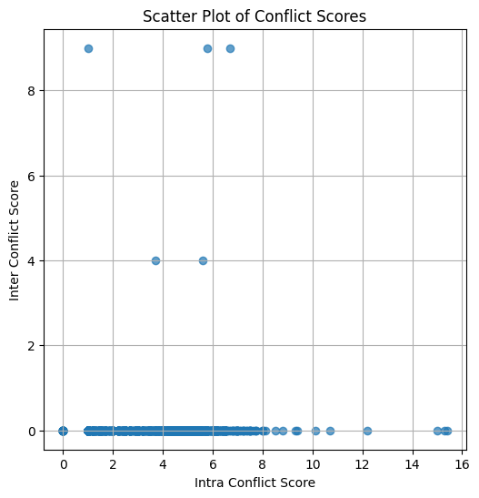
    


```python
plt.figure(figsize=(6, 4))
plt.hist(full_summary["intra_conflict_score"], bins=30, color="steelblue", edgecolor="black", alpha=0.8)
plt.xlabel("Intra Conflict Score")
plt.ylabel("Frequency")
plt.title("Histogram of Intra Conflict Scores")
plt.grid(True)
plt.show()
```


    
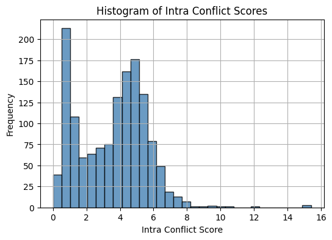
    


```python
high_conflict_df = full_summary.query("intra_conflict_score >= 8 or inter_conflict_score >= 1")

```


```python
def extract_ids(subject_iri: str) -> Tuple[str, str]:
    rid_match = re.search(r"(rid\.\d+)", subject_iri)
    nm_match = re.search(r"(nm\.\d+)", subject_iri)
    rid = rid_match.group(1) if rid_match else "?"
    nm = nm_match.group(1) if nm_match else "?"
    return rid, nm
```


```python
def find_protolog_files(rid: str, nm: str, filenames: set) -> Dict[str, Optional[str] or List[str]]:
    exact = f"{rid}_{nm}.xml" if rid != "?" and nm != "?" else None
    exact_match = exact if exact in filenames else None

    partial_matches = []

    # Compile strict regex: match only if ID is surrounded by (_) or (.) or start/end of string
    rid_pattern = re.compile(rf"(^|[_\.]){re.escape(rid)}([_\.]|$)") if rid != "?" else None
    nm_pattern = re.compile(rf"(^|[_\.]){re.escape(nm)}([_\.]|$)") if nm != "?" else None

    for f in filenames:
        if exact_match and f == exact_match:
            continue
        if ((rid_pattern and rid_pattern.search(f)) or
                (nm_pattern and nm_pattern.search(f))):
            partial_matches.append(f)

    return {
        "exact": exact_match,
        "partial": sorted(partial_matches)
    }

```


```python
def load_protolog_content_pretty(filepath: str) -> Optional[str]:
    try:
        import xml.etree.ElementTree as ET
        from xml.dom import minidom

        ns = {"n4l": "http://namesforlife.com/ns/protolog"}
        ET.register_namespace('', ns["n4l"])

        tree = ET.parse(filepath)
        root = tree.getroot()
        content = root.find(".//{http://namesforlife.com/ns/protolog}content")

        if content is not None:
            # Convert ElementTree element to string
            rough_string = ET.tostring(content, encoding="utf-8")
            # Parse with minidom for pretty print
            reparsed = minidom.parseString(rough_string)
            return reparsed.toprettyxml(indent="  ")
        else:
            return "(no <content> node found)"
    except Exception as e:
        print(f"(Failed to load {filepath}: {e})")
        return None

```


```python
def display_subject_protolog(
        subject_iri: str,
        intra_score: float,
        inter_score: float,
        observations_df: pd.DataFrame,
        classes_df: pd.DataFrame
):
    rid, nm = extract_ids(subject_iri)
    print(f"## {subject_iri}")
    print(f"  - Reference ID: {rid}")
    print(f"  - Taxon Name ID: {nm}")
    print(f"  - Intra Conflict Score: {intra_score}")
    print(f"  - Inter Conflict Score: {inter_score}")

    plot_temperature_profile(subject_id=subject_iri, observations_df=observations_df, classes_df=classes_df)

    match_info = find_protolog_files(rid, nm, protologs_set)
    if match_info["exact"]:
        print(f"\n✅ Exact match: {match_info['exact']}")
        path = os.path.join(PROTOLOG_DIR, match_info["exact"])
        xml_text = load_protolog_content_pretty(path)
        if xml_text:
            print("\n--- Protolog XML ---")
            print(xml_text)
    elif match_info["partial"]:
        print(f"\n🟡 Partial matches for {rid or '[none]'}, {nm or '[none]'}:")
        for fname in match_info["partial"]:
            print(f"   - {fname}")
        for fname in match_info["partial"]:
            path = os.path.join(PROTOLOG_DIR, fname)
            xml_text = load_protolog_content_pretty(path)
            if xml_text:
                print("\n--- Protolog XML ---")
                print(xml_text)
                break
    else:
        print("\n(no protolog XML found)")
```


```python
for _, row in high_conflict_df.iterrows():
    display_subject_protolog(
        subject_iri=row["subject"],
        intra_score=row["intra_conflict_score"],
        inter_score=row["inter_conflict_score"],
        observations_df=observations_df,
        classes_df=classes_df
    )
```

    ## http://example.com/n4l/nm.14942
      - Reference ID: ?
      - Taxon Name ID: nm.14942
      - Intra Conflict Score: 8.0
      - Inter Conflict Score: 0


    
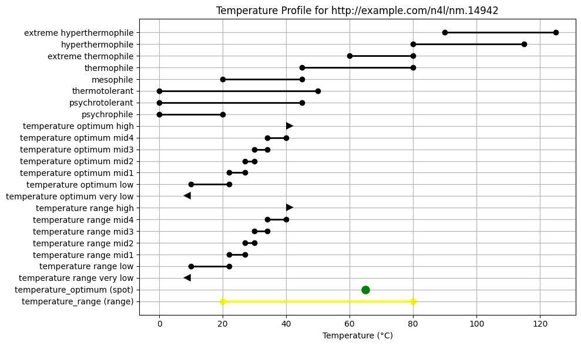
    


    
    🟡 Partial matches for ?, nm.14942:
       - rid.9958_nm.14942.xml
    
    --- Protolog XML ---
    <?xml version="1.0" ?>
    <content xmlns="http://namesforlife.com/ns/protolog">
      <p class="title">
        <s>
          Description of 
          <em>Kosmotoga olearia</em>
           sp. nov.
        </s>
      </p>
      <p class="etymology">
        <s>
          <em>Kosmotoga olearia</em>
           (o.le.a′ri.a. L. fem. adj. 
          <em>olearia</em>
           of or belonging to oil, describing the environment from which the type strain was isolated).
        </s>
      </p>
      <p class="description">
        <s>Displays the following properties in addition to those given for the genus.</s>
        <s>Cells are approximately 0.4–0.7 μm wide and 0.8–1.2 μm long, with one to three cells per sheath (toga).</s>
        <s>Rarely found in chains or aggregations of up to 50 cells.</s>
        <s>Spherical forms appear in stationary phase.</s>
        <s>Motile forms and flagella are not observed.</s>
        <s>Colonies grown on TBFXP 1 % (w/v) Gelrite bottle plates with maltose at 65 °C are 0.5–2.5 mm in diameter, circular with entire margins, convex, mucoid and opaque, grey with a slight yellow hue.</s>
        <s>Colonies grown on TBFXP 1 % (w/v) Gelrite Petri dishes with maltose at 37 °C are similar in form but larger (up to 5 mm in diameter).</s>
        <s>Grows at 20–80 °C.</s>
        <s>Heat-resistant forms (but not spores) are detected up to 90 °C.</s>
        <s>
          Growth occurs at pH 5.5–8.0 and 10–60 g NaCl l
          <sup>−1</sup>
          .
        </s>
        <s>The doubling time under optimal growth conditions (65 °C) is 103 min.</s>
        <s>At 37 °C, the optimal doubling time is 175 min.</s>
        <s>Anaerobic heterotroph; requires a reduced growth medium, but relatively tolerant of oxygen.</s>
        <s>Maltose, ribose, sucrose, starch, Casamino acids, tryptone and pyruvate can serve as growth substrates.</s>
        <s>Fructose, galactose, mannose, raffinose, xylan, casein and peptone allow relatively weaker growth.</s>
        <s>Requires yeast extract for growth.</s>
        <s>Acetate, lactate and propionate inhibit growth slightly, while malate and butanol prevent growth.</s>
        <s>Under anaerobic conditions, maltose is fermented primarily into hydrogen, carbon dioxide and acetic acid.</s>
        <s>Traces of ethanol and propionic acid are detected, but not butyric acid or alanine.</s>
        <s>
          Arabinose, CM-cellulose, cellobiose, glucose, lactose, xylose, methanol, propanol, chitin, 
          <em>myo</em>
          -inositol, putrescine and glycerol do not serve as carbon sources.
        </s>
        <s>Thiosulfate enhances growth, while elemental sulfur, nitrate and cystine do not.</s>
        <s>Sulfate also enhances growth, but sulfide is not produced.</s>
        <s>Sulfite inhibits growth slightly and nitrite prevents growth.</s>
        <s>
          Growth is inhibited by vancomycin and chloramphenicol (each at 10 μg ml
          <sup>−1</sup>
          ) and 50 μg rifampicin ml
          <sup>−1</sup>
          .
        </s>
        <s>
          Growth occurs in the presence of ampicillin, carbenicillin, kanamycin and streptomycin (each at 100 μg ml
          <sup>−1</sup>
          ).
        </s>
        <s>The G+C content of genomic DNA of the type strain is 42.5 mol%.</s>
      </p>
      <p class="description">
        <s>
          The type strain, TBF 19.5.1
          <sup>T</sup>
           (=DSM 21960
          <sup>T</sup>
           =ATCC BAA-1733
          <sup>T</sup>
          ), was isolated from oil production fluid from the Troll B platform in the North Sea.
        </s>
      </p>
    </content>
    
    ## http://example.com/n4l/nm.2843
      - Reference ID: ?
      - Taxon Name ID: nm.2843
      - Intra Conflict Score: 1.0
      - Inter Conflict Score: 9


    
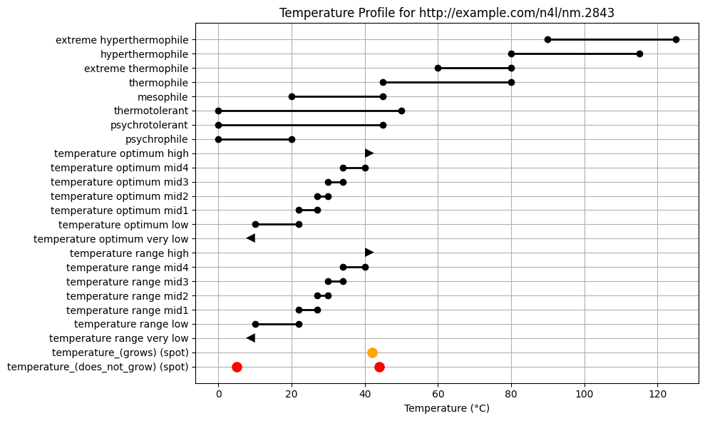
    


    
    (no protolog XML found)
    ## http://example.com/n4l/nm.4569
      - Reference ID: ?
      - Taxon Name ID: nm.4569
      - Intra Conflict Score: 15.3
      - Inter Conflict Score: 0


    
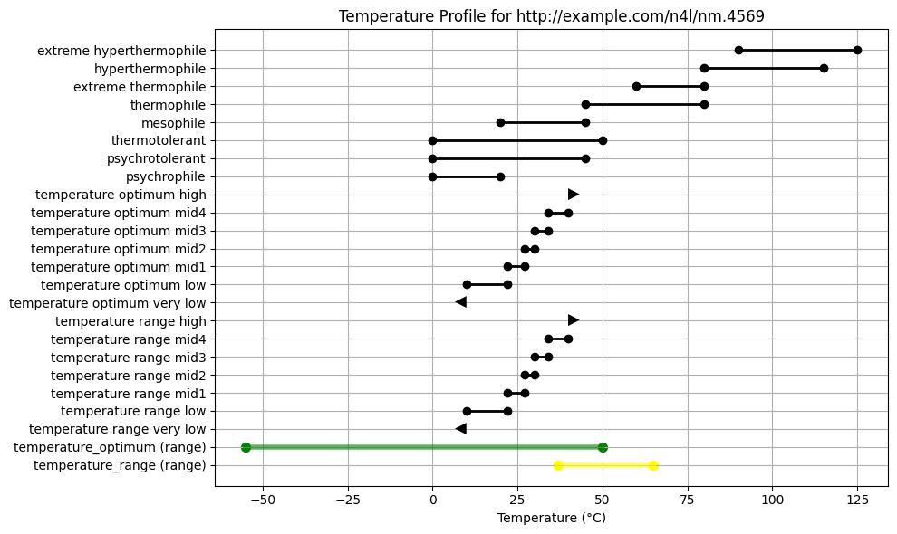
    


    
    (no protolog XML found)
    ## http://example.com/n4l/nm.554
      - Reference ID: ?
      - Taxon Name ID: nm.554
      - Intra Conflict Score: 12.2
      - Inter Conflict Score: 0


    
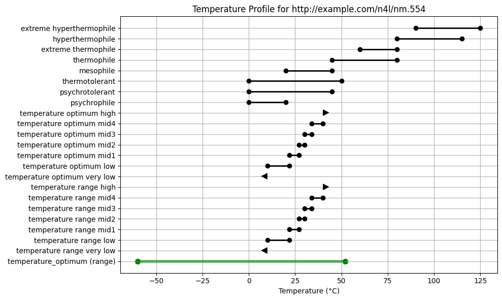
    


    
    (no protolog XML found)
    ## http://example.com/n4l/rid.1133_nm.7699
      - Reference ID: rid.1133
      - Taxon Name ID: nm.7699
      - Intra Conflict Score: 9.299999999999999
      - Inter Conflict Score: 0


    
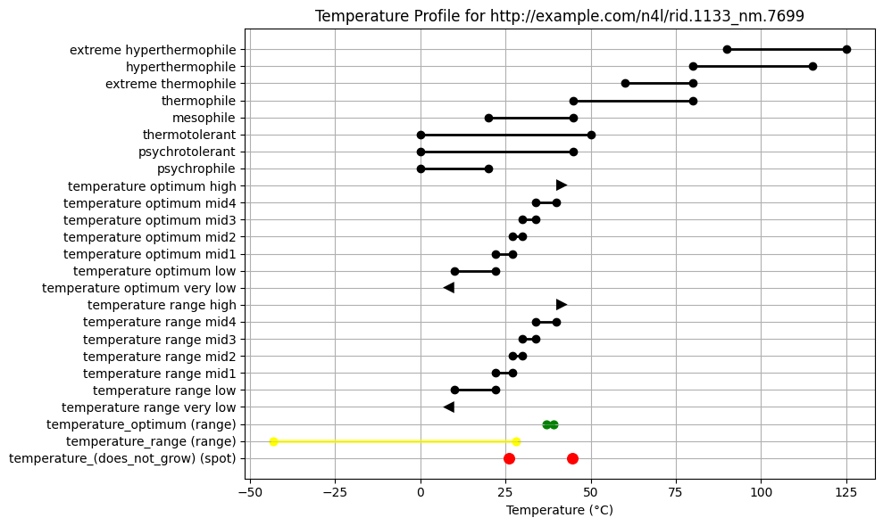
    


    
    (no protolog XML found)
    ## http://example.com/n4l/rid.2300_nm.9703
      - Reference ID: rid.2300
      - Taxon Name ID: nm.9703
      - Intra Conflict Score: 8.0
      - Inter Conflict Score: 0


    
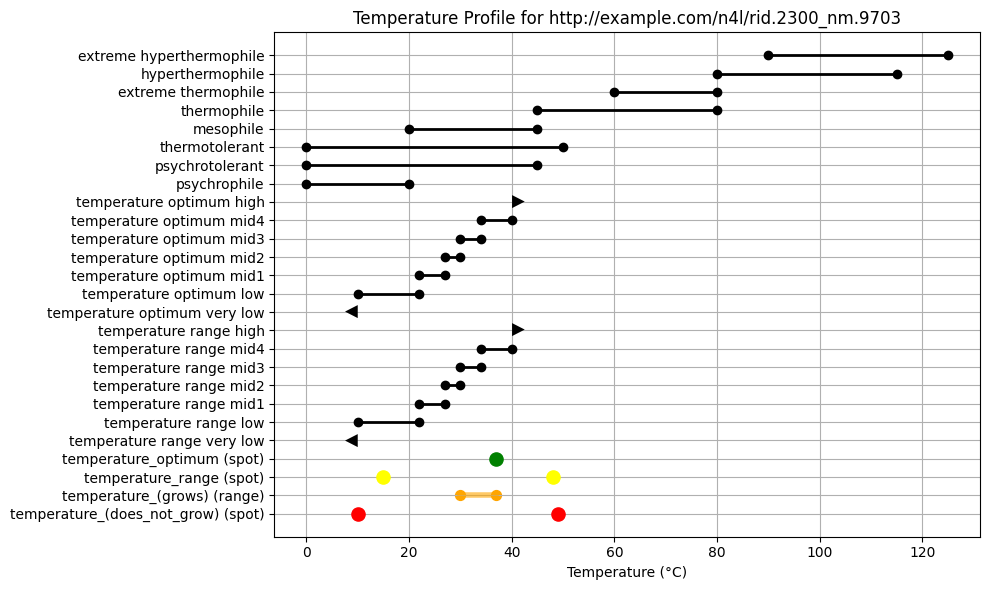
    


    
    ✅ Exact match: rid.2300_nm.9703.xml
    
    --- Protolog XML ---
    <?xml version="1.0" ?>
    <content xmlns="http://namesforlife.com/ns/protolog">
      <p class="title">
        <s>
          Description of 
          <em>Halobacillus yeomjeoni</em>
           sp. nov.
        </s>
      </p>
      <p class="etymology">
        <s>
          <em>Halobacillus yeomjeoni</em>
           (yeom.jeo′ni. N.L. gen. n. 
          <em>yeomjeoni</em>
           of yeomjeon, the Korean name for a marine solar saltern).
        </s>
      </p>
      <p class="description">
        <s>Cells are rods or long filamentous rods, measuring 0·4–0·6×2·0–100 μm, on MA supplemented with 3 % (w/v) NaCl at 37 °C; a few cells in old cultures are greater than 100 μm in length (Fig. 1).</s>
        <s>Gram-positive, but Gram-variable in old cultures.</s>
        <s>Central or subterminal ellipsoidal endospores are observed in swollen sporangia.</s>
        <s>Colonies are circular, slightly raised, glistening, light yellow in colour and 1–2 mm in size after 2 days incubation at 30–37 °C on MA supplemented with 3 % (w/v) NaCl.</s>
        <s>
          Na
          <sup>+</sup>
           and Mg
          <sup>2+</sup>
           ions are required for growth.
        </s>
        <s>The optimal growth temperature is 37 °C; growth occurs at 15 and 48 °C, but not at 10 or 49 °C.</s>
        <s>The optimal pH for growth is 7·0–8·0; growth occurs at pH 6·0, but not at pH 5·5.</s>
        <s>Optimal growth occurs in the presence of 3–5 % (w/v) NaCl; growth occurs in the presence of 0·5 % (w/v) and 21 % (w/v) NaCl, but not without NaCl or in the presence of &gt;22 % (w/v) NaCl.</s>
        <s>Tweens 20, 40 and 60 are hydrolysed.</s>
        <s>Hypoxanthine and xanthine are not hydrolysed.</s>
        <s>The Voges–Proskauer test is negative.</s>
        <s>
          Indole and H
          <sub>2</sub>
          S are not produced.
        </s>
        <s>Arginine dihydrolase, lysine decarboxylase and ornithine decarboxylase are absent.</s>
        <s>
          In assays with the API ZYM system, alkaline phosphatase, esterase (C4), esterase lipase (C8), naphthol-AS-BI-phosphohydrolase and 
          <em>β</em>
          -galactosidase are present, but lipase (C14), leucine arylamidase, valine arylamidase, cystine arylamidase, trypsin, 
          <em>α</em>
          -chymotrypsin, acid phosphatase, 
          <em>α</em>
          -galactosidase, 
          <em>β</em>
          -glucuronidase, 
          <em>α</em>
          -glucosidase, 
          <em>β</em>
          -glucosidase, 
          <em>N</em>
          -acetyl-
          <em>β</em>
          -glucosaminidase, 
          <em>α</em>
          -mannosidase and 
          <em>α</em>
          -fucosidase are absent.
        </s>
        <s>Acid is produced from d-cellobiose, d-ribose and d-mannose.</s>
        <s>
          Acid is not produced from l-arabinose, lactose, d-melezitose, melibiose, d-raffinose, l-rhamnose, 
          <em>myo</em>
          -inositol or d-sorbitol.
        </s>
        <s>The cell wall contains peptidoglycan based on l-orn–d-Asp.</s>
        <s>The predominant menaquinone is MK-7.</s>
        <s>
          The major fatty acids are anteiso-C
          <sub>15 : 0</sub>
           (40·4 %), anteiso-C
          <sub>17 : 0</sub>
           (23·0 %) and iso-C
          <sub>16 : 0</sub>
           (19·3 %).
        </s>
        <s>The DNA G+C content is 42·9 mol%.</s>
      </p>
      <p class="description">
        <s>
          The type strain, MSS-402
          <sup>T</sup>
           (=KCTC 3957
          <sup>T</sup>
          =DSM 17110
          <sup>T</sup>
          ), was isolated from a marine solar saltern of the Yellow Sea in Korea.
        </s>
      </p>
    </content>
    
    ## http://example.com/n4l/rid.2525_nm.11441
      - Reference ID: rid.2525
      - Taxon Name ID: nm.11441
      - Intra Conflict Score: 5.8
      - Inter Conflict Score: 9


    
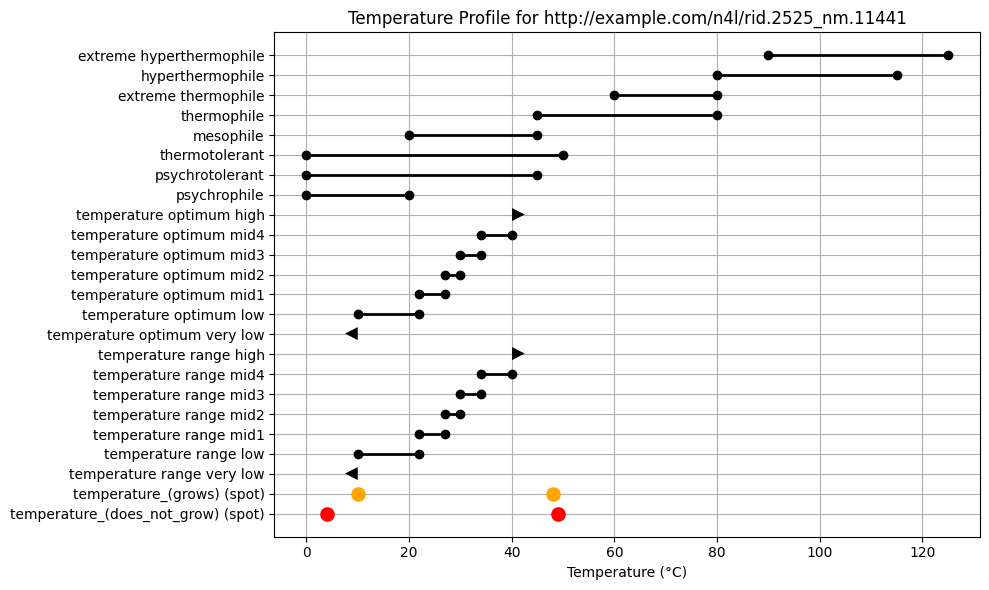
    


    
    ✅ Exact match: rid.2525_nm.11441.xml
    
    --- Protolog XML ---
    <?xml version="1.0" ?>
    <content xmlns="http://namesforlife.com/ns/protolog">
      <p class="title">
        <s>
          Description of 
          <em>Microbulbifer celer</em>
           sp. nov.
        </s>
      </p>
      <p class="etymology">
        <s>
          <em>Microbulbifer celer</em>
           (ce′ler. L. masc. adj. 
          <em>celer</em>
           rapid, pertaining to fast growth).
        </s>
      </p>
      <p class="description">
        <s>Cells are Gram-negative and rod-shaped (0.2–0.4×0.8–3.5 μm).</s>
        <s>Colonies on MA are circular to slightly irregular, slightly convex, smooth, glistening, greyish yellow in colour and 3.0–4.0 mm in diameter after 2 days incubation at 37 °C.</s>
        <s>Growth occurs at 10 and 48 °C, but not at 4 or 49 °C.</s>
        <s>The optimal pH for growth is between 7.0 and 8.0; growth occurs at pH 5.0, but not at pH 4.5.</s>
        <s>Growth occurs in the presence of 15 % (w/v) NaCl, but not in the absence of NaCl or in the presence of more than 16 % (w/v) NaCl.</s>
        <s>Anaerobic growth does not occur on MA or on MA supplemented with nitrate.</s>
        <s>Hypoxanthine and Tweens 20, 40 and 60 are hydrolysed, but urea, l-tyrosine and xanthine are not.</s>
        <s>Acetate and pyruvate are utilized, but d-glucose, d-fructose, d-galactose, d-cellobiose, d-mannose, trehalose, d-xylose, l-arabinose, sucrose, maltose, citrate, succinate, benzoate, l-malate, salicin, formate and l-glutamate are not utilized.</s>
        <s>
          Acid is produced from melibiose, but not from d-mannitol, d-melezitose, d-raffinose, l-rhamnose, d-ribose, d-sorbitol or 
          <em>myo</em>
          -inositol.
        </s>
        <s>Susceptible to chloramphenicol, kanamycin, neomycin and novobiocin and weakly susceptible to oleandomycin and polymyxin B, but not to ampicillin, carbenicillin, cephalothin, gentamicin, lincomycin, penicillin G, streptomycin or tetracycline.</s>
        <s>The predominant ubiquinone is Q-8.</s>
        <s>
          The major fatty acids (&gt;10 % of total fatty acids) are iso-C
          <sub>15 : 0</sub>
          , C
          <sub>16 : 0</sub>
           and iso-C
          <sub>17 : 0</sub>
          .
        </s>
        <s>The DNA G+C content is 57.7 mol% (determined by HPLC).</s>
        <s>Other phenotypic characteristics are given in Table 1.</s>
      </p>
      <p class="description">
        <s>
          The type strain, ISL-39
          <sup>T</sup>
           (=KCTC 12973
          <sup>T</sup>
          =CCUG 54356
          <sup>T</sup>
          ), was isolated from a marine solar saltern of the Yellow Sea in Korea.
        </s>
      </p>
    </content>
    
    ## http://example.com/n4l/rid.2578_nm.11528
      - Reference ID: rid.2578
      - Taxon Name ID: nm.11528
      - Intra Conflict Score: 6.7
      - Inter Conflict Score: 9


    
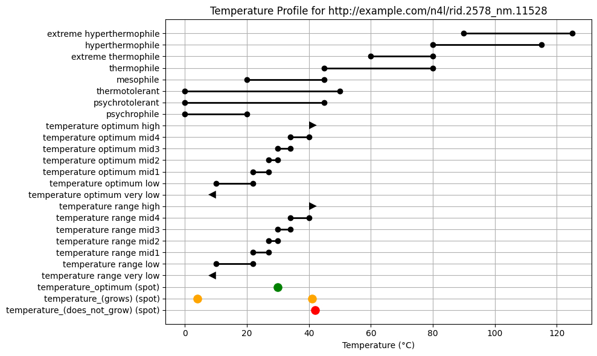
    


    
    ✅ Exact match: rid.2578_nm.11528.xml
    
    --- Protolog XML ---
    <?xml version="1.0" ?>
    <content xmlns="http://namesforlife.com/ns/protolog">
      <p class="title">
        <s>
          Description of 
          <em>Salegentibacter salarius</em>
           sp. nov.
        </s>
      </p>
      <p class="etymology">
        <s>
          <em>Salegentibacter salarius</em>
           (sa.la′ri.us. L. masc. adj. 
          <em>salarius</em>
           of, or belonging to, salt).
        </s>
      </p>
      <p class="description">
        <s>Cells are Gram-negative rods that are 0.4–0.6 μm in diameter and 0.7–4.0 μm in length and devoid of gliding motility.</s>
        <s>Colonies on MA supplemented with 6 % (w/v) NaCl are circular, convex, smooth, glistening, yellow in colour and 0.8–1.2 mm in diameter after 7 days incubation at 30 °C.</s>
        <s>Optimal growth occurs at 30 °C.</s>
        <s>Growth occurs at 4 and 41 °C, but not at 42 °C.</s>
        <s>Optimal pH for growth is 7.0–8.0; growth occurs at pH 5.5, but not at pH 5.0.</s>
        <s>Optimal growth occurs in the presence of 8 % (w/v) NaCl; growth occurs in the presence of 2–15 % (w/v) NaCl.</s>
        <s>Growth does not occur under anaerobic conditions.</s>
        <s>Flexirubin-type pigments are not produced.</s>
        <s>Aesculin, l-tyrosine and Tween 60 are hydrolysed and Tween 80 is hydrolysed weakly, but hypoxanthine and xanthine are not.</s>
        <s>l-Malate is utilized, but d-cellobiose, d-fructose, d-galactose, maltose, d-mannose, trehalose, d-xylose, acetate, citrate, succinate, benzoate, pyruvate, salicin, formate and l-glutamate are not.</s>
        <s>Acid is produced from d-fructose, but not from d-mannose, d-melezitose, melibiose, d-ribose or trehalose.</s>
        <s>Susceptible to cephalothin, chloramphenicol, novobiocin and oleandomycin, but not to gentamicin or polymyxin B.</s>
        <s>
          In the API ZYM system, alkaline phosphatase, esterase (C4), esterase lipase (C8), leucine arylamidase, valine arylamidase, acid phosphatase, naphthol-AS-BI-phosphohydrolase, 
          <em>α</em>
          -glucosidase and 
          <em>N</em>
          -acetyl-
          <em>β</em>
          -glucosaminidase activities are present, but lipase (C14), cystine arylamidase, trypsin, 
          <em>α</em>
          -chymotrypsin, 
          <em>α</em>
          -galactosidase, 
          <em>β</em>
          -galactosidase, 
          <em>β</em>
          -glucuronidase, 
          <em>β</em>
          -glucosidase, 
          <em>α</em>
          -mannosidase and 
          <em>α</em>
          -fucosidase activities are absent.
        </s>
        <s>The predominant menaquinone is MK-6.</s>
        <s>
          The major fatty acids (&gt;10 % of total fatty acids) are iso-C
          <sub>15 : 0</sub>
           and anteiso-C
          <sub>15 : 0</sub>
          .
        </s>
        <s>The DNA G+C content of the type strain is 37.5 mol% (determined by HPLC).</s>
        <s>Other phenotypic characteristics are given in Table 1.</s>
      </p>
      <p class="description">
        <s>
          The type strain, ISL-6
          <sup>T</sup>
           (=KCTC 12974
          <sup>T</sup>
           =CCUG 54355
          <sup>T</sup>
          ), was isolated from a marine solar saltern of the Yellow Sea, Korea.
        </s>
      </p>
    </content>
    
    ## http://example.com/n4l/rid.2755_nm.5062
      - Reference ID: rid.2755
      - Taxon Name ID: nm.5062
      - Intra Conflict Score: 9.4
      - Inter Conflict Score: 0


    
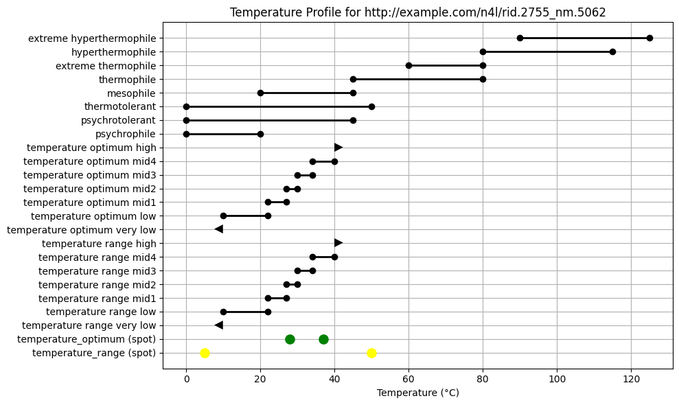
    


    
    ✅ Exact match: rid.2755_nm.5062.xml
    
    --- Protolog XML ---
    <?xml version="1.0" ?>
    <content xmlns="http://namesforlife.com/ns/protolog">
      <p class="title">
        <s>
          Emended description of the genus 
          <em>Virgibacillus</em>
           Heyndrickx 
          <em>et al.</em>
           1998
        </s>
      </p>
      <p class="etymology">
        <s>
          <em>Virgibacillus</em>
           (Vir.gi.ba.cil′lus. L. n. 
          <em>virga</em>
           a green twig, transf., a branch in a family tree; L. dim. n. 
          <em>bacillus</em>
           from 
          <em>Bacillus</em>
          , a genus of aerobic endospore-forming bacteria; N.L. n. 
          <em>Virgibacillus</em>
           a branch of the genus 
          <em>Bacillus</em>
          ).
        </s>
      </p>
      <p class="description">
        <s>Cells are motile, Gram-positive rods (0·3–0·7×2–6 μm) that occur singly, in pairs or short chains or filaments.</s>
        <s>They bear oval to ellipsoidal endospores that lie in swollen sporangia.</s>
        <s>Colonies are small, circular, low-convex and slightly transparent to opaque.</s>
        <s>Members of the genus are catalase-positive.</s>
        <s>In the API 20E strip and in conventional tests, the Voges–Proskauer reaction is negative, indole is not produced, citrate is usually not used and nitrate reduction to nitrite is variable.</s>
        <s>Urease and hydrogen sulphide are usually not produced.</s>
        <s>Gelatin, aesculin and casein are usually hydrolysed.</s>
        <s>Growth is stimulated by 4–10 % NaCl.</s>
        <s>Growth may occur between 5 and 50 °C, with an optimum of about 28 or 37 °C.</s>
        <s>d-Raffinose and d-melibiose can be used as sole carbon sources; no growth on d-arabinose, d-fructose or d-xylose.</s>
        <s>The different members of the genus show a wide range of activities in routine phenotypic tests, and this may reflect undiscovered requirements for growth factors and/or special environmental conditions.</s>
        <s>
          The major fatty acid is anteiso-C
          <sub>15 : 0</sub>
          .
        </s>
        <s>The major polar lipids are diphosphatidyl glycerol and phosphatidyl glycerol.</s>
        <s>Five phospholipids and one polar lipid of unknown structure are present in all species of the genus.</s>
        <s>Presence of phosphatidyl ethanolamine and other lipids is variable.</s>
        <s>The main menaquinone type is MK-7, with minor to trace amounts of MK-6 and MK-8.</s>
        <s>
          In the species tested, the cell wall contains peptidoglycan of the 
          <em>meso</em>
          -diaminopimelic acid type (Claus &amp; Berkeley, 1986; Arahal 
          <em>et al.</em>
          , 1999).
        </s>
        <s>The G+C content is in the range 36–43 mol%.</s>
        <s>
          The type species is 
          <em>Virgibacillus pantothenticus</em>
          .
        </s>
      </p>
    </content>
    
    ## http://example.com/n4l/rid.2759_nm.11107
      - Reference ID: rid.2759
      - Taxon Name ID: nm.11107
      - Intra Conflict Score: 8.5
      - Inter Conflict Score: 0


    
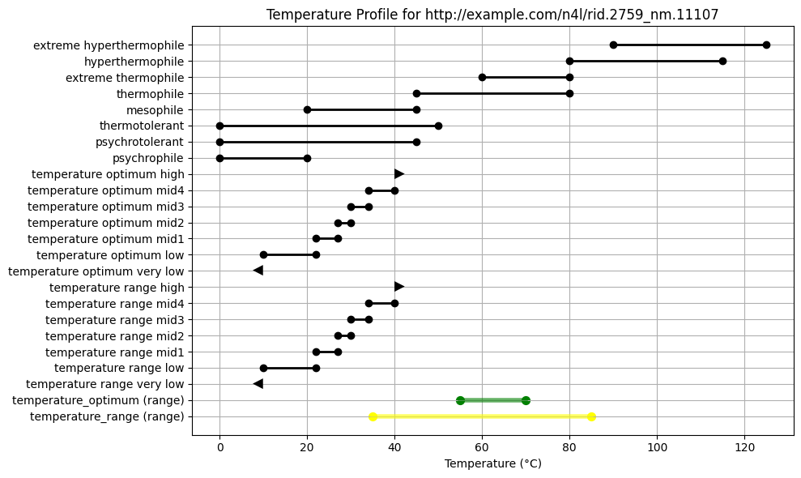
    


    
    ✅ Exact match: rid.2759_nm.11107.xml
    
    --- Protolog XML ---
    <?xml version="1.0" ?>
    <content xmlns="http://namesforlife.com/ns/protolog">
      <p class="title">
        <s>Emendation of the species description of Thermoanaerobacter brockii Zeikus, Hegge, and Anderson 1979; Lee, Jain, Lee, Lowe, and Zeikus 1993.</s>
      </p>
      <p class="etymology">
        <s>
          Thermoanaerobacter brockii (brock'i.i. M. L. gen. n. 
          <i>brockii</i>
          , of Brock, named for Thomas Dale Brock, who performed pioneering studies on the physiological ecology of extreme thermophiles)
        </s>
      </p>
      <p class="description">
        <s>Rods are 0.4 to 1.0 by 1 to 20 μm.</s>
        <s>Cells occur singly, in pairs, in short chains, and in filaments.</s>
        <s>Gram positive.</s>
        <s>Heat-resistant terminal endospores are formed.</s>
        <s>Colonies are circular and 0.2 to 4 mm in diameter.</s>
        <s>Thermophilic.</s>
        <s>The optimum growth temperature is 55 to 70°C; the temperature range for growth is 35 to 85°C.</s>
        <s>The optimum pH is 6.5 to 7.5.</s>
        <s>Obligate anaerobe.</s>
        <s>Chemoorganotrophic.</s>
        <s>Ferments hexoses and pyruvate.</s>
        <s>
          The end products of glucose fermentation are ethanol, lactate, acetate, H
          <sub>2</sub>
          , and CO
          <sub>2</sub>
          .
        </s>
        <s>Reduces thiosulfate to hydrogen sulfide.</s>
        <s>The G+C content of the DNA is 30 to 35 mol%.</s>
        <s>Isolated from the sediment of lakes, hot springs, and oil wells.</s>
      </p>
    </content>
    
    ## http://example.com/n4l/rid.3046_nm.2564
      - Reference ID: rid.3046
      - Taxon Name ID: nm.2564
      - Intra Conflict Score: 10.7
      - Inter Conflict Score: 0


    
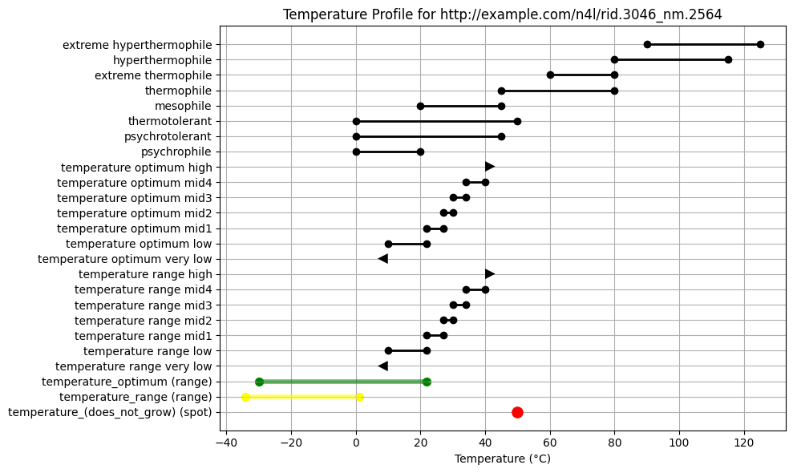
    


    
    🟡 Partial matches for rid.3046, nm.2564:
       - rid.6587_nm.2564.xml
    
    --- Protolog XML ---
    <?xml version="1.0" ?>
    <content xmlns="http://namesforlife.com/ns/protolog">
      <p class="title">
        <s>
          Emended description of 
          <em>Pseudomonas asplenii</em>
           (Ark and Tompkins 1946) Savulescu 1947
        </s>
      </p>
      <p class="etymology"/>
      <p class="description">
        <s>Has the following properties in addition to those given previously (Ark &amp; Tompkins, 1946).</s>
        <s>Oxidase-positive.</s>
        <s>
          By API 20NE, indole and 
          <em>β</em>
          -galactosidase are not produced, aesculin and gelatin are not hydrolysed and fermentation of d-glucose and assimilation of adipate are negative.
        </s>
        <s>Caprate, malate and citrate are assimilated.</s>
        <s>
          Assimilation (API 50 CH) is positive for glycerol, d-glucose, d-fructose and gluconate, and negative for erythritol, d-arabinose, l-xylose, adonitol, methyl 
          <em>β</em>
          -xyloside, l-sorbose, l-rhamnose, dulcitol, inositol, d-sorbitol, methyl 
          <em>α</em>
          -d-mannoside, methyl 
          <em>α</em>
          -d-glucoside, 
          <em>N</em>
          -acetylglucosamine, amygdalin, arbutin, salicin, d-cellobiose, d-maltose, d-lactose, d-melibiose, d-sucrose, inulin, d-melezitose, d-raffinose, starch, glycogen, xylitol, gentiobiose, d-turanose, d-lyxose, d-tagatose, d-fucose, l-fucose, l-arabitol, 2-ketogluconate and 5-ketogluconate.
        </s>
        <s>
          The following compounds are utilized (Biolog system): methyl pyruvate, 
          <em>cis</em>
          -aconitic acid, citric acid, formic acid, 
          <em>β</em>
          -hydroxybutyric acid, 
          <em>p</em>
          -hydroxyphenylacetic acid, 
          <em>α</em>
          -ketoglutaric acid, quinic acid, bromosuccinic acid, d-alanine, l-aspartic acid, l-glutamic acid, l-histidine, hydroxy-l-proline, l-proline, l-serine, dl-carnitine, 
          <em>γ</em>
          -aminobutyric acid and urocanic acid.
        </s>
        <s>
          Negative reactions (Biolog system) are observed with 
          <em>α</em>
          -cyclodextrin, dextrin, glycogen, Tween 40, 
          <em>N</em>
          -acetyl-d-galactosamine, adonitol, d-cellobiose, erythritol, l-fucose, gentiobiose, myo-inositol, 
          <em>α</em>
          -d-lactose, lactulose, maltose, d-melibiose, methyl 
          <em>β</em>
          -d-glucoside, d-psicose, d-raffinose, l-rhamnose, d-sorbitol, sucrose, d-trehalose, turanose, xylitol, d-galactonic acid lactone, 
          <em>γ</em>
          -hydroxybutyric acid, itaconic acid, 
          <em>α</em>
          -ketobutyric acid, sebacic acid, glucuronamide, glycyl l-aspartic acid, l-leucine, l-phenylalanine, l-pyroglutamic acid, d-serine, phenylethylamine, putrescine, 2,3-butanediol, 
          <em>α</em>
          -d-glucose 1-phosphate and d-glucose 6-phosphate.
        </s>
        <s>Other reactions determined by API 20NE, API 50 CH and Biolog systems are given in Table 1.</s>
      </p>
      <p class="description">
        <s>
          The type strain is DSM 17133
          <sup>T</sup>
           (=ATCC 23835
          <sup>T</sup>
          =CIP 106710
          <sup>T</sup>
          ).
        </s>
      </p>
    </content>
    
    ## http://example.com/n4l/rid.4206_nm.521
      - Reference ID: rid.4206
      - Taxon Name ID: nm.521
      - Intra Conflict Score: 15.0
      - Inter Conflict Score: 0


    
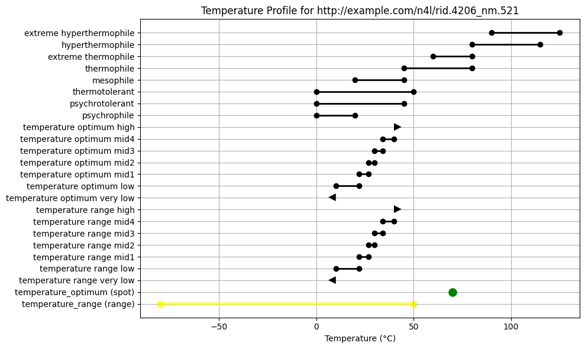
    


    
    🟡 Partial matches for rid.4206, nm.521:
       - rid.4206_nm.525.xml
    
    --- Protolog XML ---
    <?xml version="1.0" ?>
    <content xmlns="http://namesforlife.com/ns/protolog">
      <p class="title">
        <s>
          Description of 
          <i>Thermus igniterrae</i>
           sp. nov.
        </s>
      </p>
      <p class="etymology">
        <s>
          <i>Thermus igniterrae</i>
           (ig.ni.ter'rae. L. n. 
          <i>ignis</i>
           fire; L. fem. n. 
          <i>terra</i>
           land/earth; M.L. gen. fem. n. 
          <i>igniterrae</i>
           of the land of fire, referring to Iceland)
        </s>
      </p>
      <p class="description">
        <s>
          <i>T. igniterrae</i>
           strains form rod-shaped cells of variable length that are 0.5-0.8 μm wide.
        </s>
        <s>Filaments are also present.</s>
        <s>Gram stain is negative.</s>
        <s>The cells are nonmotile and spores are not formed.</s>
        <s>
          Colonies on 
          <i>Thermus</i>
           medium are yellow-pigmented and 1-2 mm in diameter after 72 h growth.
        </s>
        <s>
          Growth occurs above 45 °C and below 80 °C; the optimum growth temperature for strain RF-4
          <sup>T</sup>
           is about 65 °C.
        </s>
        <s>The optimum pH is between 7.5 and 8.5; growth does not occur at pH 5.0 or pH 10.0.</s>
        <s>The major fatty acids are 15:0 iso and 17:0 iso;3-OH fatty acids are not present.</s>
        <s>All strains are oxidase-positive and catalase-positive.</s>
        <s>
          Strain RF-4
          <sup>T</sup>
           reduces nitrate to nitrite, while strain HN1-8 does not; a-galactosidase is negative and bgalactosidase is positive.
        </s>
        <s>Elastin, starch, fibrin, casein, gelatin and hide-powder azure are hydrolysed.</s>
        <s>Arbutin and aesculin are degraded.</s>
        <s>
          Strains RF-4
          <sup>T</sup>
           and HN1-8 utilize d-glucose, D-fructose, D-mannose, maltose, ribitol, pyruvate, L-glutamate, L-glutamine and L-proline.
        </s>
        <s>
          Strains RF-4
          <sup>T</sup>
           and HN1-8 do not utilize D-galactose, D-melibiose, D-cellobiose, D-raffinose, D-xylose, D-ribose, lactose, D-mannitol, D-sorbitol, xylitol, erythritol, glycerol, malate, citrate, 
          <i>myo</i>
          -inositol, L-sorbose, L-fucose, L-arabinose, L-rhamnose, L-serine or L-arginine.
        </s>
      </p>
      <p class="description">
        <s>
          The DNA of strain RF-4
          <sup>T</sup>
           has a G+­C content of 70.3 mol%.
        </s>
        <s>This bacterium was isolated from hot springs at Reykyaflot in Iceland.</s>
        <s>
          Strain RF-4
          <sup>T</sup>
           has been deposited in the DSMZ as strain DSM 12459
          <sup>T</sup>
          .
        </s>
        <s>Strain HN1-8 (DSM 12460) is an additional strain of this species.</s>
      </p>
    </content>
    
    ## http://example.com/n4l/rid.4865_nm.1973
      - Reference ID: rid.4865
      - Taxon Name ID: nm.1973
      - Intra Conflict Score: 3.7
      - Inter Conflict Score: 4


    

    


    
    ✅ Exact match: rid.4865_nm.1973.xml
    
    --- Protolog XML ---
    <?xml version="1.0" ?>
    <content xmlns="http://namesforlife.com/ns/protolog">
      <p class="title">
        <s>
          Description of 
          <i>Laribacter hongkongensis</i>
           sp. nov.
        </s>
      </p>
      <p class="etymology">
        <s>
          <i>Laribacter hongkongensis</i>
           (
          <i>hongkongensis</i>
          , in honor of Hong Kong, means the place where the bacterium was discovered)
        </s>
      </p>
      <p class="description">
        <s>Cells are facultatively anaerobic, nonsporulating, gram-negative, seagull-shaped or spiral rods.</s>
        <s>The bacterium grows on sheep blood agar as nonhemolytic, gray colonies 1 mm in diameter after 24 h of incubation at 37°C in ambient air.</s>
        <s>Growth also occurs on MacConkey agar and at 25 and 42°C but not at 4, 44, and 50.</s>
        <s>It can grow in 1 or 2% NaCl but not in 3, 4, or 5% NaCl.</s>
        <s>
          No enhancement of growth is observed with 5% CO
          <sub>2</sub>
          .
        </s>
        <s>The organism is a flagellated and is nonmotile at both 25 and 37°C.</s>
        <s>It is oxidase, catalase, urease, and arginine dihydrolase positive, and it reduces nitrate.</s>
        <s>It does not ferment, oxidize, or assimilate any sugar tested (Table 1).</s>
        <s>The moles percent G+C content of the DNA of the strain is 68.0% ± 2.43%.</s>
        <s>The genomic size of the strain is about 3 Mb.</s>
        <s>The organism was isolated from the blood and empyema of a cirrhotic patient.</s>
        <s>
          The type strain of 
          <i>L. hongkongensis</i>
           is strain HKU1.
        </s>
        <s>Its 16S rRNA gene sequence has been deposited within the GenBank sequence database under accession no. AF389085.</s>
      </p>
    </content>
    
    ## http://example.com/n4l/rid.5540_nm.446
      - Reference ID: rid.5540
      - Taxon Name ID: nm.446
      - Intra Conflict Score: 15.4
      - Inter Conflict Score: 0


    
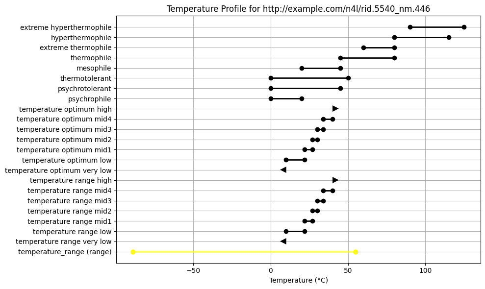
    


    
    ✅ Exact match: rid.5540_nm.446.xml
    
    --- Protolog XML ---
    <?xml version="1.0" ?>
    <content xmlns="http://namesforlife.com/ns/protolog">
      <p class="title">
        <s>
          Description of 
          <i>Thermocrinis albus</i>
           sp. nov.
        </s>
      </p>
      <p class="etymology">
        <s>
          <i>Thermocrinis albus</i>
           (al'bus. gr. 
          <i>alphos</i>
          , white, referring to the cell color)
        </s>
      </p>
      <p class="description">
        <s>Rod-shaped cells are usually between 1 and 3 μm long and 0.5 to 0.6 μm wide.</s>
        <s>Spores are not formed.</s>
        <s>Motile by means of a monopolar monotrichous flagellum.</s>
        <s>Cells occur singly, in pairs, and in aggregates consisting of up to several hundred individuals.</s>
        <s>In a permanent flow of medium, cells grow predominately as long filaments, forming visible whitish cell masses.</s>
        <s>No evidence of a regularly arrayed surface layer protein.</s>
        <s>Growth occurred at temperatures between 55° and 89°C and at salinities up to 0.7% NaCl.</s>
        <s>Aerobic.</s>
        <s>Chemolithoautotrophic.</s>
        <s>Molecular hydrogen, thiosulfate, and elemental sulfur serve as electron donors, and oxygen serves as an electron acceptor.</s>
        <s>
          <i>meso</i>
          -Diaminopimelic acid is present.
        </s>
        <s>
          Main fatty acids are C
          <sub>18:0</sub>
          , C
          <sub>18:1</sub>
          , 
          <i>cy</i>
          -C
          <sub>19</sub>
          , C
          <sub>20</sub>
          , 
          <i>n</i>
          -C
          <sub>20:1</sub>
          , and 
          <i>cy</i>
          -C
          <sub>21</sub>
          .
        </s>
        <s>
          C
          <sub>18:0</sub>
           and C
          <sub>20:1</sub>
           alkyl glycerol monoethers are present.
        </s>
        <s>The G+C content is 49.6 mol%, as calculated by direct analysis of the mononucleosides.</s>
        <s>
          The type strain is 
          <i>Thermocrinis albus</i>
           HI 11/12 (=DSM 14484, JCM 11386), which was isolated from grayish filaments collected in the Hveragerthi area, Iceland.
        </s>
      </p>
    </content>
    
    ## http://example.com/n4l/rid.5785_nm.10007
      - Reference ID: rid.5785
      - Taxon Name ID: nm.10007
      - Intra Conflict Score: 5.6
      - Inter Conflict Score: 4


    

    


    
    ✅ Exact match: rid.5785_nm.10007.xml
    
    --- Protolog XML ---
    <?xml version="1.0" ?>
    <content xmlns="http://namesforlife.com/ns/protolog">
      <p class="title">
        <s>
          Description of 
          <em>Algoriphagus terrigena</em>
           sp. nov.
        </s>
      </p>
      <p class="etymology">
        <s>
          <em>Algoriphagus terrigena</em>
           (ter.ri.ge′na. L. masc. or fem. n. 
          <em>terrigena</em>
           child of the earth, referring to the isolation of the type strain from soil).
        </s>
      </p>
      <p class="description">
        <s>Cells are Gram-negative, non-spore-forming, non-flagellated short rods or rods (0·4–0·6×0·8–2·5 μm); a few cells greater than 50 μm in length are also observed.</s>
        <s>Colonies on MA are circular, convex, smooth, glistening, light orange in colour and 1·0–2·0 mm in diameter after incubation for 7 days at 25 °C.</s>
        <s>Optimal growth occurs at 25 °C; growth occurs at 10 and 36 °C, but not at 4 or 37 °C.</s>
        <s>Optimal pH for growth is 6·5–7·5; growth occurs at pH 5·5, but not at pH 5·0.</s>
        <s>Optimal growth occurs in the presence of 2 % (w/v) NaCl; growth does not occur in the absence of NaCl or in the presence of &gt;7 % (w/v) NaCl.</s>
        <s>Growth does not occur under anaerobic conditions on MA or on MA supplemented with nitrate.</s>
        <s>Aesculin and Tweens 20, 40 and 60 are hydrolysed, but hypoxanthine, xanthine, l-tyrosine and urea are not.</s>
        <s>
          H
          <sub>2</sub>
          S is not produced.
        </s>
        <s>Arginine dihydrolase, lysine decarboxylase, ornithine decarboxylase and tryptophan deaminase are absent.</s>
        <s>
          In assays with the API ZYM system, alkaline phosphatase, esterase (C4), esterase lipase (C8), leucine arylamidase, valine arylamidase, trypsin, 
          <em>α</em>
          -chymotrypsin, acid phosphatase, naphthol-AS-BI-phosphohydrolase, 
          <em>β</em>
          -galactosidase, 
          <em>α</em>
          -glucosidase, 
          <em>β</em>
          -glucosidase and 
          <em>N</em>
          -acetyl-
          <em>β</em>
          -glucosaminidase are present, 
          <em>α</em>
          -mannosidase is weakly present, but lipase (C14), cystine arylamidase, 
          <em>α</em>
          -galactosidase, 
          <em>β</em>
          -glucuronidase and 
          <em>α</em>
          -fucosidase are absent.
        </s>
        <s>d-Cellobiose, d-fructose, d-galactose, maltose, sucrose, d-trehalose, d-xylose and salicin are utilized as sole carbon and energy sources, but acetate, benzoate, formate, l-glutamate, pyruvate and succinate are not utilized.</s>
        <s>
          Acid is produced from d-mannose, d-raffinose and d-trehalose, weakly produced from d-fructose, d-melezitose and d-ribose, but not produced from 
          <em>myo</em>
          -inositol, d-mannitol or d-sorbitol.
        </s>
        <s>Susceptible to chloramphenicol and novobiocin, but not to cephalothin.</s>
        <s>The predominant menaquinone is MK-7.</s>
        <s>
          The major fatty acids (&gt;10 % of total fatty acids) are iso-C
          <sub>15 : 0</sub>
           and C
          <sub>16 : 1</sub>
          <em>ω</em>
          7
          <em>c</em>
           and/or iso-C
          <sub>15 : 0</sub>
           2-OH.
        </s>
        <s>The DNA G+C content is 49·0 mol% (HPLC).</s>
        <s>Other phenotypic properties are shown in Table 1.</s>
      </p>
      <p class="description">
        <s>
          The type strain, DS-44
          <sup>T</sup>
           (=KCTC 12545
          <sup>T</sup>
          =CIP 108837
          <sup>T</sup>
          ), was isolated from soil from Dokdo, Korea.
        </s>
      </p>
    </content>
    
    ## http://example.com/n4l/rid.6781_nm.2698
      - Reference ID: rid.6781
      - Taxon Name ID: nm.2698
      - Intra Conflict Score: 10.1
      - Inter Conflict Score: 0


    
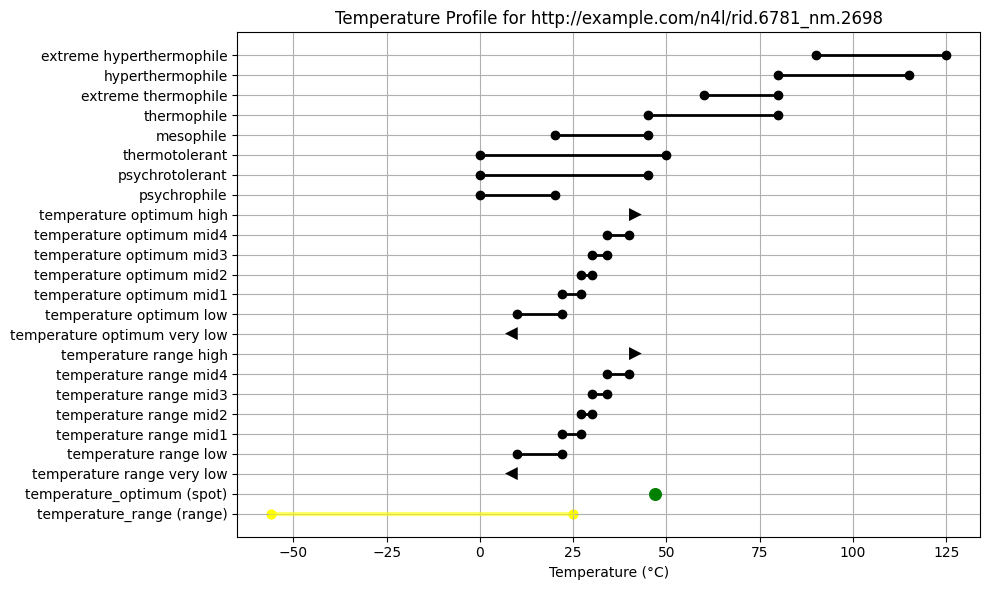
    


    
    ✅ Exact match: rid.6781_nm.2698.xml
    
    --- Protolog XML ---
    <?xml version="1.0" ?>
    <content xmlns="http://namesforlife.com/ns/protolog">
      <p class="title">
        <s>
          Description of 
          <i>Pseudomonas thermotolerans</i>
           sp. nov.
        </s>
      </p>
      <p class="etymology">
        <s>
          <i>Pseudomonas thermotolerans</i>
           (ther.mo.to'le.rans. Gr. n. 
          <i>therme</i>
           heat; L. pres. part. 
          <i>tolerans</i>
           tolerating; N.L. adj. 
          <i>thermotolerans</i>
           able to tolerate high temperatures)
        </s>
      </p>
      <p class="description">
        <s>Forms rod-shaped cells, 1.0-1.5x0.4-0.7 μm.</s>
        <s>Gram reaction is negative.</s>
        <s>Cells are motile by a single polar flagellum.</s>
        <s>Colonies grown on LA medium are not pigmented and are 1-2 mm in diameter after 24 h growth; fluorescence is not produced on King B medium.</s>
        <s>Growth occurs above 25°C and below 56°C; the optimal growth temperature for strain CM3T is approximately 47°C.</s>
        <s>Growth occurs at pH 6 and pH 10.</s>
        <s>
          Major fatty acids are C16:0, C16:1 and C18:1; 
          <i>cyclo</i>
          -C19 is present at temperatures above 37°C.
        </s>
        <s>The hydroxylated fatty acids 3-OH C10:0 and 3-OH C12:0 are also present.</s>
        <s>Ubiquinone 9 is the major respiratory quinone.</s>
        <s>Strictly aerobic and positive for cytochrome oxidase, catalase and arginine dihydrolase.</s>
        <s>Does not reduce nitrate.</s>
        <s>The nutritional pattern reveals an inability to use sugars and a preference for carbon sources with long hydrocarbon chains.</s>
        <s>
          The DNA G+C content of strain CM3
          <sup>T</sup>
           is 66.4 mol%.
        </s>
        <s>Isolated from cooking water of industrial cork transformation.</s>
        <s>
          Isolate CM3
          <sup>T</sup>
           (=DSM 14292
          <sup>T</sup>
          =LMG 21284
          <sup>T</sup>
          ) is the type strain.
        </s>
      </p>
    </content>
    
    ## http://example.com/n4l/rid.737_nm.9434
      - Reference ID: rid.737
      - Taxon Name ID: nm.9434
      - Intra Conflict Score: 8.0
      - Inter Conflict Score: 0


    
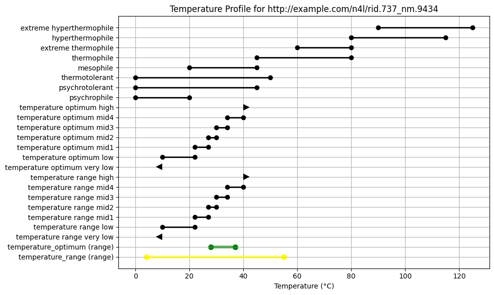
    


    
    ✅ Exact match: rid.737_nm.9434.xml
    
    --- Protolog XML ---
    <?xml version="1.0" ?>
    <content xmlns="http://namesforlife.com/ns/protolog">
      <p class="title">
        <s>
          Description of 
          <em>Naxibacter alkalitolerans</em>
           sp. nov.
        </s>
      </p>
      <p class="etymology">
        <s>
          <em>Naxibacter alkalitolerans</em>
           (al.ka.li.to′le.rans. Arabic article 
          <em>al</em>
           the; Arabic n. 
          <em>qaliy</em>
           ashes of saltwort; French n. 
          <em>alcali</em>
           alkali; N.L. n. 
          <em>alkali</em>
           alkali; L. part. adj. 
          <em>tolerans</em>
           tolerating; N.L. part. adj. 
          <em>alkalitolerans</em>
           alkali-tolerating).
        </s>
      </p>
      <p class="description">
        <s>In addition to the characteristics that define the genus, the species has the characteristics described below.</s>
        <s>Colonies are 1·1–1·4 mm in diameter, circular, entire, convex, glistening, butyraceous, opaque and with pale white–yellow to straw-colour on nutrient agar plates.</s>
        <s>Cells are 0·45–0·8 μm wide and 1·35–2 μm long.</s>
        <s>Endospores are not observed.</s>
        <s>Polyhydroxyalkanoates are not formed.</s>
        <s>The isolate cannot grow in the presence of sodium chloride at 3 %.</s>
        <s>Temperature range for growth is 4–55 °C, with optimum growth occurring at 28–37 °C.</s>
        <s>pH range for growth is 6·5–12·0, with optimum growth occurring between pH 7·0 and 9·0.</s>
        <s>Dextrin, dulcitol, glycerol, inositol, mannose, mannitol, melibiose, melezitose, raffinose, ribose, salicin and xylitol are utilized as sole carbon and energy sources, but not adonitol, arabitol, galacturonate, inositol, oxalate, sorbitol or 5-ketogluconate.</s>
        <s>Nitrate, l-threonine, l-valine, l-hydroxyproline, l-lysine, l-tryptophan, l-proline, l-tyrosine, phenylalanine, l-histidine and l-asparagine (weak) are used as sole nitrogen sources, but not l-methionine, l-glutamic acid, glycine, l-arginine or l-cysteine.</s>
        <s>Urea, acetamide, xanthine, hypoxanthine, aesculin, keratin, chitin and DNA are hydrolysed.</s>
        <s>Tweens 20 and 80 are degraded, but not cellulose, starch, allantoin, glucosamine, amygdalin or adenine.</s>
        <s>
          Tests for gelatin, melanin production and H
          <sub>2</sub>
          S production are positive; however, those for nitrate reduction, indole production, resistance to KCN, milk coagulation and peptonization are negative.
        </s>
        <s>
          Tests for lipase, ornithine decarboxylase, 
          <em>β</em>
          -glucosidase, 
          <em>β</em>
          -galactosidase, 
          <em>α</em>
          -glucosidase and 
          <em>α</em>
          -galactosidase are positive.
        </s>
        <s>
          Tests for arginine dihydrolase, lysine decarboxylase and 
          <em>N</em>
          -acetyl-
          <em>β</em>
          -glucosaminidase are negative.
        </s>
        <s>Resistant to lysozyme, penicillin G, vancomycin, polymyxin B, tobramycin sulfate, gentamicin sulfate, netilmicin, oleandomycin and ciprofloxacin (weak), but sensitive to erythromycin, terramycin, aureomycin, tetracycline, streptomycin sulfate, amikacin, novobiocin, kanamycin, nalidixic acid and chloramphenicol.</s>
        <s>
          The cellular fatty acid profiles are C
          <sub>16 : 1</sub>
          <em>ω</em>
          7
          <em>c</em>
           (42·4 %), C
          <sub>16 : 0</sub>
           (28·1 %), C
          <sub>17 : 0</sub>
           cyclo (6·8 %), C
          <sub>12 : 0</sub>
           (6·1 %), C
          <sub>18 : 1</sub>
          <em>ω</em>
          7
          <em>c</em>
           (4·3 %), C
          <sub>10 : 0</sub>
           3-OH (4·2 %), C
          <sub>14 : 0</sub>
           (3·4 %), C
          <sub>18 : 1</sub>
          <em>ω</em>
          9
          <em>c</em>
           (1·2 %), C
          <sub>10 : 0</sub>
           (0·5 %), C
          <sub>18 : 0</sub>
           (0·4 %), C
          <sub>12 : 0</sub>
           2-OH (0·3 %) and C
          <sub>15 : 0</sub>
           (0·2 %).
        </s>
        <s>The isoprenoid quinones are Q-8 (93·4 %) and Q-7 (6·6 %).</s>
        <s>The phospholipids are phosphatidylglycerol, phosphatidylethanolamine and phosphatidylinositol mannosides.</s>
        <s>The G+C content of genomic DNA is 62·4±0·3 mol%.</s>
      </p>
      <p class="description">
        <s>
          The type strain is YIM 31775
          <sup>T</sup>
           (=CCTCC AA 204003
          <sup>T</sup>
          =KCTC 12194
          <sup>T</sup>
          ), which was isolated from soil in Lijiang, Yunnan Province, China.
        </s>
      </p>
    </content>
    
    ## http://example.com/n4l/rid.800_nm.4600
      - Reference ID: rid.800
      - Taxon Name ID: nm.4600
      - Intra Conflict Score: 8.1
      - Inter Conflict Score: 0


    
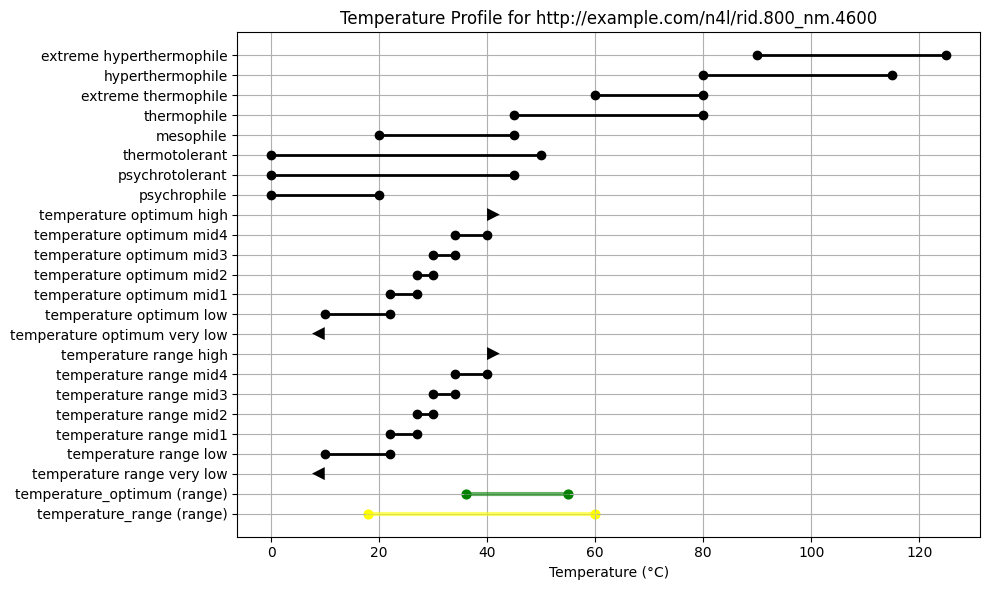
    


    
    ✅ Exact match: rid.800_nm.4600.xml
    
    --- Protolog XML ---
    <?xml version="1.0" ?>
    <content xmlns="http://namesforlife.com/ns/protolog">
      <p class="title">
        <s>
          Description of 
          <i>Halonatronum saccharophilum</i>
           sp. nov.
        </s>
      </p>
      <p class="etymology">
        <s>
          <i>Halonatronum saccharophilum</i>
           (Sac.cha.ro.philum. From Gr. n. 
          <i>sacchar</i>
          , sugar and Gr. adj. 
          <i>philus</i>
          , liking. A sugar-liking organism.
        </s>
      </p>
      <p class="description">
        <s>Slender flexible rods, 0.4–0.6 × 3.5−10 μm in young cultures; long thickened degenerate cells, spheroplasts, and spores are characteristic of aging cultures.</s>
        <s>Spores are round, terminal, thermostable, of the plectridial type.</s>
        <s>The cell wall is characterized by a gram-negative structural pattern.</s>
        <s>Cells are motile by means of peritrichous flagella.</s>
      </p>
      <p class="description">
        <s>A moderate haloalkaliphile obligatorily requiring sodium chloride and carbonate and growing within the NaCl concentration range of 3–17% with an optimum at 7–12% and at pH 7.7–10.3 with a pH optimum of 8.0–8.5.</s>
        <s>A moderate thermophile growing at 18–60°C with an optimum within the broad temperature range of 36–55°C.</s>
        <s>The doubling time is 2.5 h under optimum conditions.</s>
      </p>
      <p class="description">
        <s>An obligate anaerobe with the fermentative type of metabolism.</s>
        <s>Ferments glucose, fructose, sucrose, maltose, starch, glycogen, N-acetyl-D-glucosamine, and, to a slight degree, peptone and yeast extract.</s>
        <s>A chemoorganotroph whose metabolism requires yeast extract or amino acids.</s>
        <s>
          Formate, ethanol, acetate, H
          <sub>2</sub>
          , and CO
          <sub>2</sub>
           form as glucose fermentation products.
        </s>
        <s>Uses sulfur as electron acceptor in a process that yields no energy.</s>
        <s>Sulfide-tolerant.</s>
      </p>
      <p class="description">
        <s>The G+C content of DNA is 34.3 mol %.</s>
      </p>
      <p class="description">
        <s>Isolated from the bottom deposits of the coastal lagoon of Lake Magadi (Kenya).</s>
        <s>
          Z-7986
          <sup>T</sup>
           (=DSM13868, =Uniqem 211) is the type strain of the species.
        </s>
      </p>
    </content>
    
    ## http://example.com/n4l/rid.8217_nm.13296
      - Reference ID: rid.8217
      - Taxon Name ID: nm.13296
      - Intra Conflict Score: 8.8
      - Inter Conflict Score: 0


    
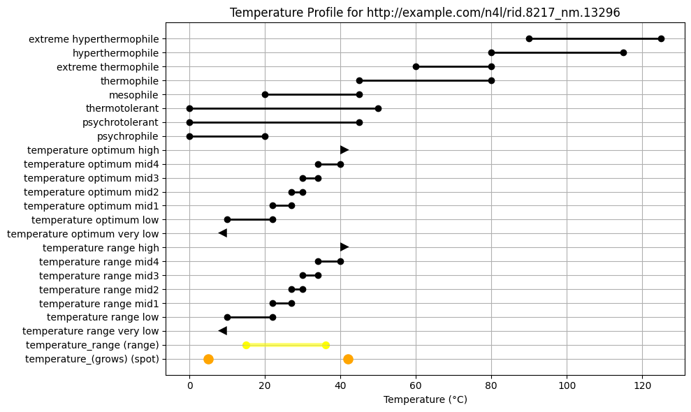
    


    
    ✅ Exact match: rid.8217_nm.13296.xml
    
    --- Protolog XML ---
    <?xml version="1.0" ?>
    <content xmlns="http://namesforlife.com/ns/protolog">
      <p class="title">
        <s>
          Description of 
          <em>Deinococcus aquatilis</em>
           sp. nov.
        </s>
      </p>
      <p class="etymology">
        <s>
          <em>Deinococcus aquatilis</em>
           (a.qua.ti′lis. L. masc. adj. 
          <em>aquatilis</em>
           living in water).
        </s>
      </p>
      <p class="description">
        <s>Cells stain Gram-positive and are non-motile, non-spore-forming rods.</s>
        <s>Aerobic and oxidase-positive.</s>
        <s>Good growth after 48 h on R2A agar, nutrient agar and tryptic soy agar at 15–36 °C.</s>
        <s>Colonies on nutrient agar are smooth, pale pinkish, circular, translucent and shiny with entire edges, becoming mucoid.</s>
        <s>Unable to grow at 5 or 42 °C.</s>
        <s>Growth occurs at pH 5.5–11.</s>
        <s>
          Major cellular fatty acids are C
          <sub>16 : 1</sub>
          <em>ω</em>
          7
          <em>c</em>
          , C
          <sub>17 : 1</sub>
          <em>ω</em>
          8
          <em>c</em>
          , iso-C
          <sub>17 : 1</sub>
          <em>ω</em>
          9
          <em>c</em>
          , C
          <sub>16 : 0</sub>
          , iso-C
          <sub>17 : 0</sub>
           and C
          <sub>15 : 1</sub>
          <em>ω</em>
          6
          <em>c</em>
          .
        </s>
        <s>MK-8 is the predominant lipoquinone.</s>
        <s>
          Presents a complex polar lipid profile, consisting of different unidentified glycolipids and polar lipids, two unknown phospholipids and three unknown phosphoglycolipids, among them a predominant phosphoglycolipid with a migration on TLC similar to that of 2′-
          <em>O</em>
          -(1,2-diacyl-
          <em>sn</em>
          -glycero-3-phospho)-3′-
          <em>O</em>
          -(
          <em>α</em>
          -galactosyl)-
          <em>N</em>
          -d-glyceroyl alkylamine, which has been identified in 
          <em>Deinococcus radiodurans</em>
          .
        </s>
        <s>The polyamine pattern consists of the predominant component spermidine and traces of spermine, putrescine and 1,3-diaminopropane.</s>
        <s>
          The following compounds are utilized as sole carbon sources (positive after prolonged incubation for 14 days according to the method of Kämpfer 
          <em>et al.</em>
          , 1991): d-glucose, sucrose, 
          <em>N</em>
          -acetyl-d-glucosamine, maltose and acetate.
        </s>
        <s>
          The following compounds are not utilized: d-gluconate, propionate, 
          <em>cis</em>
          - and 
          <em>trans</em>
          -aconitate, 4-aminobutyrate, citrate, fumarate, glutarate, dl-3-hydroxybutyrate, itaconate, dl-lactate, l-malate, mesaconate, 2-oxoglutarate, pyruvate, l-alanine, 
          <em>β</em>
          -alanine, l-aspartate, l-leucine, l-ornithine, l-proline, l-serine, 
          <em>N</em>
          -acetylgalactosamine, l-arabinose, l-arbutin, cellobiose, d-fructose, d-galactose, d-mannose, 
          <em>α</em>
          -melibiose, l-rhamnose, d-ribose, salicin, trehalose, d-xylose, adonitol, 
          <em>myo</em>
          -inositol, maltitol, d-mannitol, d-sorbitol, putrescine, adipate, azelate, suberate, l-histidine, l-phenylalanine, l-serine, l-tryptophan, 3-hydroxybenzoate and phenylacetate.
        </s>
        <s>
          bis-
          <em>p</em>
          -Nitrophenyl (pNP) phosphate, bis-pNP phenylphosphonate and bis-pNP phosphorylcholine are hydrolysed on the basis of the method described by Kämpfer 
          <em>et al.</em>
           (1991).
        </s>
        <s>
          The following compounds are not hydrolysed: pNP 
          <em>β</em>
          -d-galactopyranoside, pNP 
          <em>β</em>
          -d-glucuronide, pNP 
          <em>α</em>
          -d-glucopyranoside, pNP 
          <em>β</em>
          -d-glucopyranoside, pNP 
          <em>β</em>
          -d-xylopyranoside, l-aniline 
          <em>p</em>
          -nitroanilide (pNA), 
          <em>γ</em>
          -l-glutamate pNA and l-proline pNA.
        </s>
      </p>
      <p class="description">
        <s>
          The type strain is CCUG 53370
          <sup>T</sup>
           (=CCM 7524
          <sup>T</sup>
          ), isolated from water.
        </s>
      </p>
    </content>
    


```python

```
