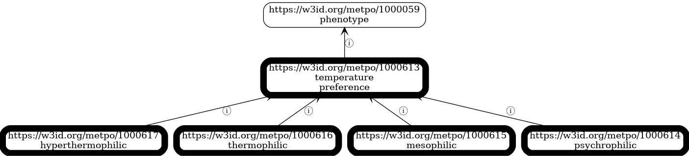

<!-- _class: lead -->

# METPO: A Pragmatic Ontology for Microbial Ecophysiological Traits

**Mark Andrew Miller**
Lawrence Berkeley National Laboratory

ICBO 2025 • Tuesday, November 11

---

## How can we design experiments to make better use of microbes for our environment and economy?

**We will need to characterize their ecophysiological traits:**
Environmental preferences and metabolic capabilities that define where and how microbes grow:
- Temperature preference (psychrophilic ≤15°C, **mesophilic** 20-45°C, thermophilic ≥45°C)
- Oxygen requirements (aerobic, anaerobic)
- pH tolerance, salinity tolerance, metabolic pathways

**The challenge:** Trait data is abundant but semantically inconsistent across major datasets, limiting its use in machine learning.

**The Microbial Ecophysiological Trait and Phenotype Ontology (METPO)** provides standardization.

---

## Data Source 1: Madin et al. (flat table)

**condensed_traits_NCBI.csv**

| taxon | tax_id | optimum_tmp | temp_pref |
|-------|--------|-------------|-----------|
| Acetobacter fabarum | 483199 | 28 | mesophilic |

**Format:** Flat CSV table
**Taxon:** `taxon` (name) + `tax_id` (NCBI taxonomy ID)
**Temperature:** Numeric (`optimum_tmp`) + qualitative (`temp_pref`)

---

## Data Source 2: BactoTraits (3-header CSV)

**BactoTraits_databaseV2_Jun2022.csv**

| | | temp_Optimum | | |
|---|---|----------|---|---|
| | | Celsius degree | | |
| Bacdive_ID | Full_name | TO_27_to_30 | TO_30_to_34 | TO_>40 |
| 19 | Acetobacter oeni Silva et al. 2006 | **1** | 0 | 0 |

**Format:** Semicolon-delimited CSV with 3 header rows (category, units, column names)
**Taxon:** `Bacdive_ID` + `Full_name` columns
**Temperature:** Weighted values across temperature ranges (sum to 1.0)

---

## Data Source 3: BacDive (nested JSON)

**BacDive API**

```json
{
  "General": {
    "BacDive-ID": 100,
    "keywords": ["anaerobe", "mesophilic"],
    "NCBI tax id": [{"NCBI tax id": 33025, "Matching level": "species"}]
  },
  "Name and taxonomic classification": {
    "species": "Phascolarctobacterium faecium"
  },
  "Culture and growth conditions": {
    "culture temp": {
      "temperature": "37"
    }
  }
}
```

**Format:** Nested JSON (some paths are deeply nested)
**Source:** BacDive REST API

---

## Cannot query "all mesophiles" across datasets without semantic normalization

**Each dataset uses different:**
- File formats (JSON, CSV)
- Column naming conventions
- Value representations (qualitative vs. quantitative)
- Taxon identifiers

**Solution:** We need an ontology to provide semantic interoperability.

---

## The Gap in the Ontology Landscape

We evaluated existing ontologies for microbial trait coverage:

| Ontology | Last Updated |
|----------|--------------|
| **MPO** (Microbial Phenotype Ontology) | 2014 |
| **MicrO** (Microbiology Ontology) | 2018 |
| **MCO** (Microbial Conditions Ontology) | 2019 |
| **OMP** (Ontology of Microbial Phenotypes) | 2024 |
| **PATO** (Phenotype and Trait Ontology) | Active |

**Key findings:**
- No single ontology provides comprehensive coverage for BacDive, BactoTraits, and Madin datasets
- Many domain-specific ontologies lack active maintenance
- Integration of multiple ontologies introduces significant complexity

---

## Introducing METPO

**Microbial Ecophysiological Trait and Phenotype Ontology**

**Design philosophy:** Application-driven development
- **Focused:** 255 classes covering BacDive, BactoTraits, and Madin datasets
- **Lightweight:** Purpose-built for KG-Microbe knowledge graph
- **Modern:** ODK and ROBOT tooling
- **Maintained:** Active development for DOE CMM project and CultureBot

**Core principle:** Build ontologies that serve real applications, driven by actual data integration needs.

---

## Synonym provenance tracking using annotated axioms

```turtle
[] a owl:Axiom ;
  owl:annotatedSource metpo:1000644 ;
  owl:annotatedProperty oboInOwl:hasRelatedSynonym ;
  owl:annotatedTarget "aerobic_heterotrophy" ;
  IAO:0000119 <https://github.com/jmadin/bacteria_archaea_traits> .

[] a owl:Axiom ;
  owl:annotatedSource metpo:1000644 ;
  owl:annotatedProperty oboInOwl:hasRelatedSynonym ;
  owl:annotatedTarget "heterotroph" ;
  IAO:0000119 <https://bacdive.dsmz.de/> .
```

---

## METPO's Object Property Model

<div class="columns">
<div>

**1. Phenotype Assertions**

```turtle
metpo:2000102 a owl:ObjectProperty ;
  rdfs:label "has phenotype" ;
  rdfs:domain metpo:1000525 ;  # microbe
  rdfs:range metpo:1000059 .   # phenotype

# Usage example:
NCBITaxon:562 metpo:2000102 metpo:1000602 .
# E. coli has_phenotype aerobic
```

**2. Process Capabilities**

```turtle
metpo:2000103 a owl:ObjectProperty ;
  rdfs:label "capable of" ;
  rdfs:domain metpo:1000525 ;  # microbe
  rdfs:range metpo:1000630 .   # process

# B. subtilis capable_of sporulation
```

</div>
<div>

**3. Chemical Interactions (20+ subproperties)**

```turtle
metpo:2000001 a owl:ObjectProperty ;
  rdfs:label "organism interacts with chemical" ;
  rdfs:domain metpo:1000525 ;  # microbe
  rdfs:range metpo:1000526 .   # chemical

# Subproperties include:
# ferments, uses_as_carbon_source, degrades,
# uses_as_electron_acceptor, oxidizes, reduces
# ... 14 more

# Example:
NCBITaxon:562 metpo:2000011 CHEBI:17234 .
# E. coli ferments glucose
```

</div>
</div>

---

## METPO in Production: Powering KG-Microbe

<div class="columns">
<div>

**Before: Heterogeneous Data**

```
// BacDive (nested JSON)
Culture and growth conditions.culture temp.temperature: "37"

// BactoTraits (boolean columns)
TO_27_to_30: 1

// Madin (qualitative term)
temp_pref: "mesophilic"
```

Three formats, three schemas, different representations.

**Cannot query across datasets.**

</div>
<div>

**After: Unified Knowledge Graph (KGX)**

```tsv
subject          predicate              object
NCBITaxon:100   biolink:has_phenotype  METPO:1000615
NCBITaxon:200   biolink:has_phenotype  METPO:1000615
NCBITaxon:300   biolink:has_phenotype  METPO:1000615
```

All variations normalized to single METPO CURIE.

**Now queryable with SPARQL (for example):**
```sparql
SELECT ?taxon WHERE {
  ?taxon biolink:has_phenotype METPO:1000615
}
```

</div>
</div>

---

## KG-Microbe Statistics

**Real-world usage across three major datasets:**

| Dataset | Source Records | Total KG Edges | METPO Object Edges | METPO Coverage* | METPO Terms |
|---------|----------------|----------------|-------------------|----------------|-------------|
| **BactoTraits** | 19,455 strains | 87,688 | 87,688 | 100% | 91 |
| **Madin et al.** | 172,324 taxa | 115,399 | 45,851 | 39.7% | 36 |
| **BacDive** | 196,169 strains | 1,656,667 | 120,266 | 7.3% | 61 |
| **Combined** | — | 1,859,754 | 253,805 | 13.6% | **152 unique** |

**METPO Coverage*** = % of edges using METPO terms in object position (semantic grounding)

*Coverage is ETL-dependent: reflects what was extracted, not full METPO potential

---

## KG-Microbe: METPO as Semantic Backbone


152 unique METPO terms normalize traits across all three datasets

---

## Applications: CultureBot & DOE CMM-REE

**KG-Microbe → METPO dependency chain**

<div class="columns">
<div>

**CultureBot** (LBNL LDRD FY24-FY25, NCE through Dec 2025)
- AI-driven prediction of microbial growth conditions
- **Depends on:** KG-Microbe as feature backbone for graph learning
- **Needs METPO for:** Consistent phenotype encoding across training data
- **Result:** Explainable predictions for lab automation

Joachimiak + Deutschbauer (EGSB)
[github.com/culturebotai](https://github.com/culturebotai)

</div>
<div>

**DOE CMM-REE Project**
- Rare Earth Element biorecovery research
- **Depends on:** KG-Microbe for microbial trait integration
- **Needs METPO for:** Standardized phenotype vocabulary
- **Result:** Data-driven microbe selection

**Both projects validate METPO's design:**
- Real production dependencies (not demos)
- Drive active maintenance & curation
- Prove value of application-driven ontology development

</div>
</div>

---

## Interoperability: METPO is a Good Citizen

**SSSOM Mappings:** ~3,000 via embedding search (OLS + BioPortal + n4l_merged)
- Relaxed: 3,008 mappings (mostly broadMatch/relatedMatch)
- Optimized: 2,883 mappings (73 exactMatch)
- Method: `text-embedding-3-small`

**Reality check:** Mean structural coherence = 8.2%
- Semantic matches exist, but hierarchical organization differs significantly
- Justifies purpose-built ontology over importing external structures

**Availability:** BioPortal, GitHub (berkeleybop/metpo), standard OWL/RDF formats, works with OAK, ROBOT, Protégé

---

## OntoGPT Grounding: Literature-Driven Expansion

**Structured data integration (Phase 1):** Near completion
- 253,805 METPO edges in KG-Microbe
- Three major datasets fully integrated
- METPO provides semantic normalization layer

**Literature mining (Phase 2):** Less mature
- 10 PubMed abstracts processed through OntoGPT
- Mixed grounding success identifies where METPO needs expansion
- 52 failed groundings → curation priorities for domain experts

**Insight:** Failed groundings are features, not bugs—they guide ontology development

---

## Future Work: Optimize Literature-Based Discovery

**Expanding METPO through OntoGPT experiments:**

<div class="columns">
<div>

**Input:** PubMed abstract
```text
Methylovirgula ligni gen. nov., sp. nov.,
an obligately acidophilic, facultatively
methylotrophic bacterium...

Two strains (BW863T and BW865) of
Gram-negative, aerobic, non-pigmented,
non-motile, rod-shaped bacteria were
isolated...
```

</div>
<div>

**Output:** RDF triples (Turtle)
```turtle
# BW863 → AUTO:BW863 (extracted organism)
AUTO:BW863 strain_of NCBITaxon:569860 . # Methylovirgula ligni
AUTO:BW863 has_phenotype METPO:1000143 . # Gram-negative
AUTO:BW863 has_phenotype METPO:1000602 . # aerobic
AUTO:BW863 has_phenotype AUTO:rod-shaped . # gap!
AUTO:BW863 has_phenotype METPO:1000181 . # mesophilic
```

**Results (10 PubMed abstracts):**
- Phenotype: 41.0% to METPO (25/61)
- Chemical: 75.0% to ChEBI (33/44)
- Taxonomy: 93.3% to NCBITaxon (14/15)
- 36 AUTO phenotype terms → coverage gaps

</div>
</div>

---

## Data-Driven Ontology Development

**Failed groundings drive iterative expansion:**

1. Literature mining identifies phenotype: "rod-shaped"
2. OntoGPT cannot ground → produces AUTO:rod-shaped
3. Triggers curation workflow
4. Domain expert adds term to METPO
5. Future extractions ground successfully

---

## Sustainability & Governance

**Users of METPO:**
- **CultureBot LDRD:** ML models for predicting microbial growth conditions
- **DOE CMM-REE:** Rare earth element biorecovery research

**Built for longevity:**
- **Active funding:** DOE CMM project (FY26) + CultureBot LDRD (through 2025)
- **Low-barrier contributions:** Spreadsheet-based curation, LLM-assisted workflows
- **Modern build system:** ODK + ROBOT (standard OBO tooling, won't bitrot)
- **Open source:** GitHub repository, community contributions welcome

---

## Conclusion

**METPO demonstrates an application-driven approach:**

- **Production validation:** 253,805 edges in 1.86M-edge knowledge graph
- **Sustainability:** Active funding, real dependencies, modern tooling
- **Institutional support:** Candidate for BER Data Lake House
- **Transparency:** All claims traceable to primary sources
- **Interoperability:** ~3,000 SSSOM mappings (but low structural coherence: 8.2%)
- **AI-assisted:** LLM-powered curation workflows

**Key insight:** Purpose-built ontologies work when driven by real needs—even when existing ontologies have poor structural alignment

---

<!-- _class: lead -->

# Thank You

**Resources:**
github.com/berkeleybop/metpo
bioportal.bioontology.org/ontologies/METPO

**Contact:** Mark Andrew Miller, LBNL
**PI:** Marcin Joachimiak

**Acknowledgments:**
CultureBot LDRD • DOE CMM Program

Questions?

---

## Backup Slides

---

## CMM Project Context

**Advanced Biorecovery of Critical Minerals through AI/ML-Guided Design**

**Goal:** Recover Rare Earth Elements (Nd, Pr, Dy) from e-waste using engineered microbes

**KG-CMREE extends KG-Microbe:**
- Adds REE bioaccumulation phenotypes
- Lanthanophore biosynthetic pathways
- Spectroscopic measurements
- High-throughput screening results

**METPO's role:** Annotates microbial traits critical for REE recovery
- pH tolerance, temperature tolerance, metal tolerance, metabolic capabilities
- Enables AI models to predict which microbes can thrive in REE recovery conditions

---

## Real Data Example: KG-Microbe Triples

**From BacDive transformed data (`edges.tsv`):**

| subject | predicate | object | relation | primary_knowledge_source |
|---------|-----------|--------|----------|--------------------------|
| NCBITaxon:100 | biolink:has_phenotype | METPO:1001102 | RO:0002200 | bacdive:17384 |
| NCBITaxon:100 | biolink:has_phenotype | METPO:1000615 | RO:0002200 | bacdive:17391 |
| NCBITaxon:100 | biolink:has_phenotype | METPO:1000615 | RO:0002200 | bacdive:17384 |

**KGX format combines:**
- **Biolink predicates** (`biolink:has_phenotype`) - high-level semantic relations
- **RO relations** (`RO:0002200` = "has phenotype") - precise OBO semantics
- **Primary source** - Each triple traceable to BacDive strain ID

---

## METPO's Phenotype Hierarchies: Temperature



---

## METPO's Phenotype Hierarchies: Cell Shape


---

## METPO's Phenotype Hierarchies: Respiration


---

## Technical Details: METPO Development

**Source of truth:** ROBOT-compatible spreadsheets (Google Sheets)

**Build system:** Ontology Development Kit (ODK)

**Validation:** ROBOT validation passed

**Semantic search:** OLS + BioPortal + n4l_merged embeddings, generates SSSOM mappings

**Data infrastructure:** All three datasets (BacDive, BactoTraits, Madin) staged in MongoDB alongside IJSEM metadata and text mining results from ePMC

**Statistics:** 255 terms, 118 with definitions (46.3%), 158 mapped to 24 external ontologies

---

## Design Rationale: Why Build METPO?

**Coverage challenge:**
- Existing ontologies lack comprehensive coverage for our three datasets
- Integration complexity increases non-linearly with number of source ontologies
- Unmaintained ontologies present long-term sustainability risks

---

## Design Rationale (continued)

**Practical approach:**
- Build focused ontology for immediate application needs
- Map to external ontologies for interoperability (~3,000 SSSOM mappings)
- Maintain lightweight hierarchy optimized for our use cases

**Development efficiency:**
- 255 terms covers core needs vs. integrating dozens of partial ontologies
- Spreadsheet-based curation accessible to domain experts
- ODK/ROBOT automation prevents technical debt

---

## Comprehensive Ontology Survey: What We Evaluated

**Systematic embedding-based testing:**

- **39 ontologies tested** (778K total embeddings)
- **24 retained** for mapping (20 from OLS, 4 from BioPortal only, plus n4l_merged)

**Final set:** upheno, go, oba, flopo, micro, pato, envo, ecocore, eupath, phipo, mco, eco, omp, ohmi, cmpo, biolink, apo, pco, geo, exo, d3o, meo, miso, n4l_merged

**Result:** 3,019 SSSOM mappings

---

## Why Not Import? Minimum Import Set Analysis

**Q: Based on high-quality matches, how many ontologies would we need to import?**

**Excellent matches (similarity ≥ 0.75):**
- 182 matches across 21 ontologies
- Top 8 provide 91% coverage: micro (91), upheno (19), mpo (16), n4l_merged (14), oba (10), envo (4), biolink (4), flopo (3)

**Answer: ~8 ontologies for 90% coverage**

---

## Why METPO Uses Mappings Instead

**Why METPO uses mappings instead:**
- **8 ontology imports:** Complex integration, licensing, hierarchy conflicts, maintenance burden
- **255 METPO classes + 3,019 mappings:** Structural independence, clean hierarchies, focused scope
- Both achieve interoperability, but METPO maintains consistency for KG-Microbe reasoning

**Structural incompatibility:** Different hierarchical philosophies make direct import challenging
- METPO: trait-centric organization for database annotation
- Others: quality-centric, interaction-centric, or process-centric

---

## Multiple Backend Registries for Semantic Search

**METPO embedding search uses three complementary backends:**

1. **OLS (Ontology Lookup Service)** - Primary OBO Foundry registry
2. **BioPortal** - Broader biomedical ontology collection (includes DSMZ ontologies)
3. **Semantic-SQL** - SQL-queryable ontology views

---

## Semantic-SQL Quality Metric

**Semantic-SQL as a quality metric:**
- Some ontologies don't convert cleanly to semsql with standard methods
- Conversion failure indicates structural or metadata issues
- Used alongside OLS/BioPortal availability to assess ontology quality

**METPO integration:**
- Available in all three backends (OLS, BioPortal, semantic-sql)
- Queryable via SPARQL, REST APIs, and SQL
- Part of broader OBO ecosystem

**More info:** https://github.com/INCATools/semantic-sql

---

## Object Prefix Distribution: METPO Expansion Opportunities

**Object prefix distribution by edge count:**

<div class="columns">
<div>

**Madin et al.** (115,399 edges):
- METPO: 45,851 edges (39.7%)
- CHEBI: 37,173 (32.2%)
- NCBITaxon: 26,649 (23.1%)
- pathways: 4,463 (3.9%)
- GO: 1,262 (1.1%)
- carbon_substrates: 1

**BactoTraits** (87,688 edges):
- METPO: 87,688 edges (100%)

</div>
<div>

**BacDive** (1,656,667 edges):
- NCBITaxon: 678,379 edges (40.9%)
- CHEBI: 428,815 (25.9%)
- EC: 186,014 (11.2%)
- strain: 185,928 (11.2%)
- METPO: 120,266 (7.3%)
- medium: 52,995 (3.2%)
- pathogen: 3,411 (0.2%)
- salinity: 190
- pathways: 183
- assay: 455
- CAS-RN: 31

</div>
</div>

---

## METPO Expansion Opportunities

**Based on unique values in object position:**
- **salinity:** 4 unique values (`extremely_halophilic`, `moderately_halophilic`, etc.) - could align to METPO halophilic classes
- **pathogen:** 3 unique values (`animal`, `human`, `plant`) - could align to existing pathogenicity ontologies or add to METPO
- **pathways:** 72-73 unique values (`denitrification`, `aromatic_compound_degradation`, etc.) - consider alignment to GO biological processes

**~8,000 edges could increase METPO coverage with better ETL alignment**
