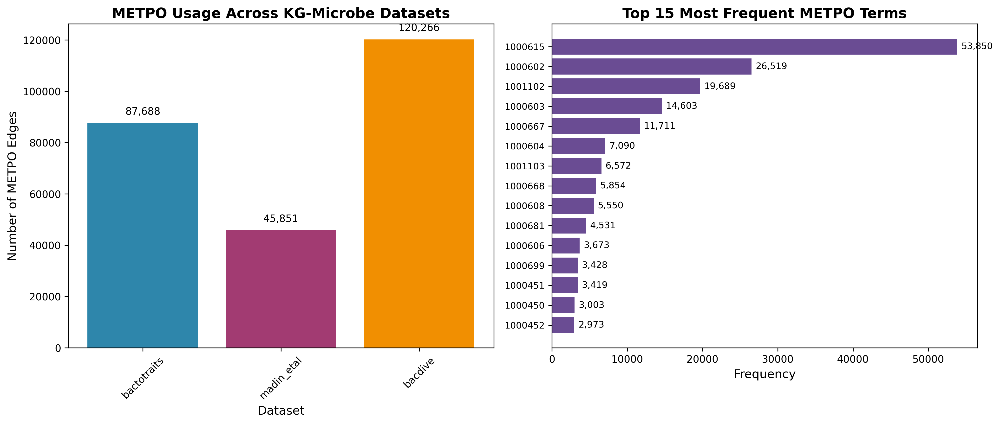
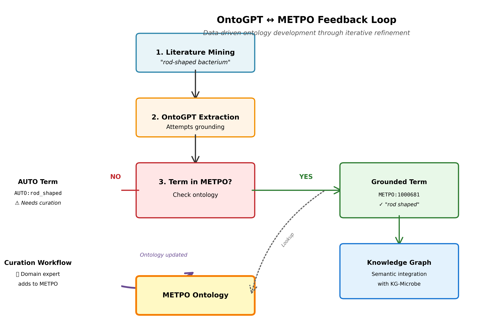

<!-- _class: lead -->

# METPO: A Pragmatic Ontology for Microbial Ecophysiological Traits

**Mark Miller**
Lawrence Berkeley National Laboratory

ICBO 2025 • Tuesday, November 11

---

## The Data Integration Challenge

Microbial trait data is exploding, but it's semantically inconsistent:

<div class="columns3">
<div>

**BacDive (nested JSON)**
```json
{
  "culture_temp": {
    "temperature":
      "mesophilic"
  }
}
```

</div>
<div>

**BactoTraits (multi-header CSV)**
```
Trait_class | Trait_name | Unit
Temperature | Class      |
            | mesophile  |
```

</div>
<div>

**Madin et al. (flat table)**
```csv
taxon,temp_pref
12345,mesophilic
```

</div>
</div>

**Problem:** Cannot query "all psychrophiles" across datasets without semantic normalization.

**Solution:** We need an ontology.

---

## The Gap in the Ontology Landscape

We evaluated existing ontologies for microbial trait coverage:

| Ontology | Last Updated | Status | Domain |
|----------|--------------|--------|--------|
| **MPO** | 2014 | Unmaintained | Microbial Phenotypes |
| **MicrO** | 2018 | Unmaintained | Microbiology |
| **MCO** | 2019 | Unmaintained | Microbial Conditions |
| **OMP** | 2024 | Active | Microbe Phenotypes |
| **PATO** | Active | Active | Quality Attributes |

**Key findings:**
- No single ontology provides comprehensive coverage for BacDive, BactoTraits, and Madin datasets
- Many domain-specific ontologies lack active maintenance
- Integration of multiple ontologies introduces significant complexity

---

## Introducing METPO

**Microbial Ecophysiological Trait and Phenotype Ontology**

**Design philosophy:** Application-driven development
- **Focused:** 255 classes covering BacDive, BactoTraits, and Madin datasets
- **Lightweight:** Purpose-built for KG-Microbe knowledge graph
- **Modern:** ODK, ROBOT, OAK tooling
- **Maintained:** Active development for DOE CMM project ($850K FY26)

**Core principle:** Build ontologies that serve real applications, driven by actual data integration needs.

---

## METPO's Modern & Pragmatic Design

<div class="columns">
<div>

**1. Captures Real-World Variations**

METPO synonyms handle messy data:

```turtle
METPO:1000615 a owl:Class ;
  rdfs:label "mesophilic" ;
  oboInOwl:hasExactSynonym
    "mesophile" ;
  oboInOwl:hasExactSynonym
    "temperature: mesophilic" ;
  oboInOwl:hasExactSynonym
    "temp_class: mesophile" .
```

Enables semantic normalization across all three data sources.

</div>
<div>

**2. LLM-Assisted Curation**

- Semantic search pipeline:
  - OLS + BioPortal + Names4Life embeddings
  - ~3,000 METPO mappings to external ontologies
  - SSSOM format (skos:exactMatch, closeMatch, relatedMatch, broadMatch)

- Modern development practices:
  - ODK build system for consistency
  - ROBOT validation in CI/CD
  - Spreadsheet-based curation for accessibility

**ICBO 2025 Theme:** AI-enabled ontology development

</div>
</div>

---

## METPO in Production: KG-Microbe Statistics

**Real-world usage across three major datasets:**

| Dataset | Records | METPO Edges | Coverage | METPO Terms Used |
|---------|---------|-------------|----------|------------------|
| **BactoTraits** | 19,456 strains | 87,688 | 100% | 91 |
| **Madin et al.** | 172,324 taxa | 45,851 | 39.7% | 36 |
| **BacDive** | 196,169 nodes | 120,266 | 7.3% | 61 |
| **Combined** | 1.86M edges | 253,805 | 13.6% | **152 unique** |

**Source:** Direct analysis of KG-Microbe transformed data (TSV files)

*All statistics traceable to primary sources in `/kg-microbe/data/transformed/`*

---

## METPO in Action: Powering KG-Microbe

<div class="columns">
<div>

**Before: Heterogeneous Data**

```json
// BacDive
{"culture_temp": "mesophilic"}

// BactoTraits
[blank][mesophile][blank]

// Madin
temperature_preference: mesophilic
```

Three formats, three field names, slight variations in values.

**Cannot query across datasets.**

</div>
<div>

**After: Unified Knowledge Graph (KGX)**

```tsv
subject          predicate              object
NCBITaxon:100   biolink:has_phenotype  METPO:1000615
NCBITaxon:200   biolink:has_phenotype  METPO:1000615
NCBITaxon:300   biolink:has_phenotype  METPO:1000615
```

All variations normalized to single METPO CURIE.

**Now queryable with SPARQL/Cypher:**
```sparql
SELECT ?taxon WHERE {
  ?taxon biolink:has_phenotype METPO:1000615
}
```

</div>
</div>

---

## KG-Microbe: METPO as Semantic Backbone



**Production knowledge graph for growth media prediction:**
- **253,805 METPO edges** across 1.86M total edges
- **152 unique METPO terms** normalize traits from three heterogeneous datasets
- **Biolink model compliance** enables standard graph queries
- **Application:** CMM project - predicting organisms for REE biorecovery

*Figure: METPO usage distribution across KG-Microbe datasets*

---

## Real Data Example: KG-Microbe Triples

**From transformed data (BacDive → KGX):**

```tsv
# Nodes
METPO:1000615  biolink:PhenotypicQuality  mesophilic
METPO:1000602  biolink:PhenotypicQuality  aerobic
METPO:1000614  biolink:PhenotypicQuality  psychrophilic
METPO:1000644  biolink:PhenotypicQuality  heterotrophic

# Edges
NCBITaxon:100  biolink:has_phenotype  METPO:1000615  RO:0002200  bacdive:17384
NCBITaxon:100  biolink:has_phenotype  METPO:1000602  RO:0002200  bacdive:17385
NCBITaxon:200  biolink:has_phenotype  METPO:1000614  RO:0002200  bacdive:23451
```

**This is production data** - METPO CURIEs in use, enabling ML predictions.

---

## Future Work: Literature-Based Discovery

**Expanding METPO through OntoGPT experiments:**

<div class="columns">
<div>

**Input:** PubMed abstract
```text
Methylovirgula ligni gen. nov., sp. nov.,
an obligately acidophilic, facultatively
methylotrophic bacterium...

Two strains of Gram-negative, aerobic,
non-pigmented, non-motile, rod-shaped
bacteria were isolated...
```

</div>
<div>

**Output:** RDF triples (Turtle)
```turtle
AUTO:BW863
  has_phenotype METPO:1000143 . # ✅ Gram-negative
AUTO:BW863
  has_phenotype METPO:1000008 . # ✅ aerobic
AUTO:BW863
  has_phenotype AUTO:rod-shaped . # ❌ gap!
AUTO:BW863
  has_phenotype METPO:1000181 . # ✅ mesophilic
```

**Results across 10 PubMed abstracts:**
- 32.5% phenotype grounding to METPO (25/77 terms)
- 100% chemical grounding to ChEBI (47/47 terms)
- 100% taxonomic grounding to NCBITaxon (22/22 terms)
- 52 AUTO terms indicate coverage gaps for future curation

</div>
</div>

---

## Data-Driven Ontology Development



**Failed groundings drive iterative expansion:**

1. Literature mining identifies phenotype: "rod-shaped"
2. OntoGPT cannot ground → produces AUTO:rod-shaped
3. Triggers curation workflow
4. Domain expert adds term to METPO
5. Future extractions ground successfully

**This is METPO's living development model.**

<!-- TODO: Generate this Mermaid diagram -->

---

## OntoGPT Grounding: Data-Driven Expansion

**Structured data integration (Phase 1):** Production-ready
- 253,805 METPO edges in KG-Microbe
- Three major datasets fully integrated
- METPO provides semantic normalization layer

**Literature mining (Phase 2):** Experimental validation
- 10 PubMed abstracts processed through OntoGPT
- Mixed grounding success identifies where METPO needs expansion
- 52 failed groundings → curation priorities for domain experts

**Insight:** Failed groundings are features, not bugs—they guide ontology development

---

## METPO Hierarchy Example


**Organized for our use case:**
- Temperature preferences (psychrophilic → mesophilic → thermophilic)
- Oxygen requirements (aerobic, anaerobic, microaerophilic)
- Metabolic capabilities (heterotrophic, autotrophic, mixotrophic)
- Chemical interaction properties (65+ predicates for organism-chemical relationships)

<!-- TODO: Generate with runoak viz -->

---

## Interoperability: METPO is a Good Citizen

**SSSOM Mappings to external ontologies:**

Two mapping strategies evaluated:

| Strategy | Total Mappings | Match Types |
|----------|----------------|-------------|
| **Combined Relaxed** | 2,659 broadMatch<br/>171 relatedMatch<br/>113 closeMatch<br/>65 exactMatch | Mixed precision |
| **Optimized** | 2,590 relatedMatch<br/>220 closeMatch<br/>73 exactMatch | Higher precision |

**Integration approach:** Pragmatic mappings enable interoperability while maintaining METPO's focused design

**Availability:**
- BioPortal: https://bioportal.bioontology.org/ontologies/METPO
- GitHub: https://github.com/berkeleybop/metpo
- Standard formats: OWL/RDF, works with OAK, ROBOT, Protégé

---

## Sustainability & Governance

**How we ensure METPO won't be abandoned:**

1. **Active funding:** DOE CMM project ($850K FY26) - REE biorecovery research
2. **Real application:** KG-Microbe depends on METPO for production predictions
3. **Modern tooling:** ODK, ROBOT, OAK prevent bitrot
4. **Accessible contribution:** ROBOT-compatible spreadsheets, not complex OWL
5. **LLM-assisted workflows:** Scalable curation, undergraduate-accessible

**Governance:**
- PI: Marcin Joachimiak (LBNL)
- Driven by application needs (pragmatic, not theoretical)
- Community contributions via GitHub

**ICBO 2025 Theme:** Long-term sustainability

---

## Conclusion

**METPO demonstrates an application-driven approach to ontology development:**

✅ **Production validation:** 253,805 edges across 1.86M-edge knowledge graph
✅ **Sustainability by design:** Active funding, real application dependencies, modern tooling
✅ **Transparent metrics:** All claims traceable to primary data sources
✅ **Pragmatic interoperability:** ~3,000 mappings to external ontologies via SSSOM
✅ **AI-assisted workflows:** LLM-powered curation and semantic search pipelines

**Key insight:** Purpose-built ontologies can effectively serve specialized domains when:
- Driven by concrete application needs (KG-Microbe)
- Supported by active maintenance (CMM project funding)
- Built with modern practices (ODK, ROBOT, spreadsheet curation)
- Validated against real data (BacDive, BactoTraits, Madin datasets)

---

<!-- _class: lead -->

# Thank You

**METPO Resources:**
- GitHub: https://github.com/berkeleybop/metpo
- BioPortal: https://bioportal.bioontology.org/ontologies/METPO

**KG-Microbe:**
- GitHub: https://github.com/Knowledge-Graph-Hub/kg-microbe

**Contact:**
- Mark Miller, LBNL
- PI: Marcin Joachimiak

**Acknowledgments:**
DOE CMM Program • LBNL Biosciences Division • OntoGPT/OAK teams

Questions?

---

## Backup Slides

---

## CMM Project Context

**Advanced Biorecovery of Critical Minerals through AI/ML-Guided Design**

**Goal:** Recover Rare Earth Elements (Nd, Pr, Dy) from e-waste using engineered microbes

**KG-CMREE extends KG-Microbe:**
- Adds REE bioaccumulation phenotypes
- Lanthanophore biosynthetic pathways
- Spectroscopic measurements
- High-throughput screening results

**METPO's role:** Annotates microbial traits critical for REE recovery
- pH tolerance, temperature tolerance, metal tolerance, metabolic capabilities
- Enables AI models to predict which microbes can thrive in REE recovery conditions

---

## Technical Details: METPO Development

**Source of truth:** ROBOT-compatible spreadsheets (Google Sheets)
**Build system:** Ontology Development Kit (ODK)
**Validation:** ROBOT (0 errors, 318 minor whitespace warnings)
**Semantic search:** Custom pipeline
- OLS + BioPortal + Names4Life embeddings in SQLite
- openai_text-embedding-3-small model
- Generates SSSOM mappings

**Statistics:**
- 255 total terms
- 118 with definitions (46.3%)
- 158 mapped to 24 external ontologies (62%)
- ~250 classes in hierarchy

---

## Design Rationale: Why Build METPO?

**Coverage challenge:**
- Existing ontologies lack comprehensive coverage for our three datasets
- Integration complexity increases non-linearly with number of source ontologies
- Unmaintained ontologies present long-term sustainability risks

**Practical approach:**
- Build focused ontology for immediate application needs
- Map to external ontologies for interoperability (~3,000 SSSOM mappings)
- Maintain lightweight hierarchy optimized for our use cases

**Development efficiency:**
- 255 terms covers core needs vs. integrating dozens of partial ontologies
- Spreadsheet-based curation accessible to domain experts
- ODK/ROBOT automation prevents technical debt

---

## Comprehensive Ontology Survey: What We Evaluated

**Systematic testing documented in PRIMARY SOURCES:**

**ChromaDB testing (verified via SQL queries):**
- **39 ontologies embedded** with 778,496 total embeddings
- Top tested: CHEBI (221K), upheno (192K), GO (84K), OBA (73K), foodon (40K)
- **24 ontologies retained:** 20 OLS + 4 BioPortal-only
- **15 removed:** Including CHEBI (worst ROI despite size)

**Final retained set (from ChromaDB SQL queries):**
- **20 from OLS:** upheno, go, oba, flopo, micro, pato, envo, ecocore, eupath, phipo, mco, eco, omp, ohmi, cmpo, biolink, apo, pco, geo, exo
- **4 from BioPortal (verified via API):**
  - d3o (DSMZ Digital Diversity Ontology)
  - meo (Metagenome and Microbes Environmental Ontology)
  - miso (Microbial Isolation Source Ontology)
  - n4l_merged (Names4Life - NOT in any registry)

**SSSOM mappings generated:** 3,019 total mappings (from TSV parsing)

**Sources:** ChromaDB SQLite databases, SSSOM TSV file, OLS/BioPortal APIs
**See:** PRIMARY_SOURCE_ONTOLOGY_ANALYSIS.md for complete verification

---

## Why Not Import? Minimum Import Set Analysis

**Q: Based on high-quality matches, how many ontologies would we need to import?**

**Analysis of SSSOM mappings (PRIMARY SOURCE: .sssom.tsv file):**

**Excellent matches (similarity ≥ 0.75, distance < 0.25):**
- 182 total excellent matches across 21 ontologies
- **Top 8 ontologies provide 91% coverage:**
  1. micro (91 matches)
  2. upheno (19)
  3. mpo (16)
  4. n4l_merged (14)
  5. oba (10)
  6. envo (4)
  7. biolink (4)
  8. flopo (3)

**Parsimonious import requirement: ~8 ontologies for 90% coverage**

**Why METPO uses mappings instead:**
- **8 ontology imports:** Complex integration, licensing, hierarchy conflicts, maintenance burden
- **255 METPO classes + 3,019 mappings:** Structural independence, clean hierarchies, focused scope
- Both achieve interoperability, but METPO maintains consistency for KG-Microbe reasoning

**Structural incompatibility:** Different hierarchical philosophies make direct import challenging
- METPO: trait-centric organization for database annotation
- Others: quality-centric, interaction-centric, or process-centric

**Source:** Direct analysis of metpo_mappings_combined_relaxed.sssom.tsv

---

## Semantic-SQL Ontology Registry

**INCATools semantic-sql project maintains a comprehensive ontology registry:**

**Registry location:**
```
/home/mark/gitrepos/semantic-sql/src/semsql/builder/registry/ontologies.yaml
```

**Purpose:** Provides standardized SQL views for 113 OBO and biomedical ontologies
- Includes URLs, build commands, prefix mappings for each ontology
- Used to generate SQLite databases for efficient querying
- Examples: GO, CHEBI, ENVO, PATO, MONDO, HP, and many more

**METPO in semantic-sql:**
- METPO available as `metpo.db` in semantic-sql directory
- Queryable via standard SQL interfaces
- Most ontologies we use are specialized/domain-specific

**Ontology availability (verified via API queries):**
- **In OLS:** micro, upheno, oba, flopo, envo, biolink, go, pato, etc.
- **BioPortal-only (verified):** d3o, meo, miso (DSMZ ontologies)
- **Not in registries:** n4l_merged (Names4Life specialized resource)

**More info:** https://github.com/INCATools/semantic-sql
