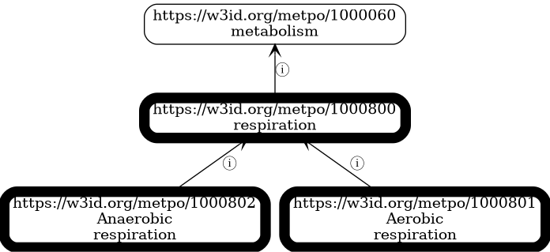

<!-- _class: lead -->

# METPO: A Pragmatic Ontology for Microbial Ecophysiological Traits

**Mark Miller**
Lawrence Berkeley National Laboratory

ICBO 2025 • Tuesday, November 11

---

## The Data Integration Challenge

Microbial trait data is abundant, but it's semantically inconsistent:

<div class="columns3">
<div>

**BacDive (nested JSON)**
```json
{
  "culture_temp": {
    "temperature":
      "mesophilic"
  }
}
```

</div>
<div>

**BactoTraits (multi-header CSV)**
```
Trait_class | Trait_name | Unit
Temperature | Class      |
            | mesophile  |
```

</div>
<div>

**Madin et al. (flat table)**
```csv
taxon,temp_pref
12345,mesophilic
```

</div>
</div>

**Problem:** Cannot query "all psychrophiles" across datasets without semantic normalization.

**Solution:** We need an ontology.

---

## The Gap in the Ontology Landscape

We evaluated existing ontologies for microbial trait coverage:

| Ontology | Last Updated | Status | Domain |
|----------|--------------|--------|--------|
| **MPO** | 2014 | Unmaintained | Microbial Phenotypes |
| **MicrO** | 2018 | Unmaintained | Microbiology |
| **MCO** | 2019 | Unmaintained | Microbial Conditions |
| **OMP** | 2024 | Active | Microbe Phenotypes |
| **PATO** | Active | Active | Quality Attributes |

**Key findings:**
- No single ontology provides comprehensive coverage for BacDive, BactoTraits, and Madin datasets
- Many domain-specific ontologies lack active maintenance
- Integration of multiple ontologies introduces significant complexity

---

## Introducing METPO

**Microbial Ecophysiological Trait and Phenotype Ontology**

**Design philosophy:** Application-driven development
- **Focused:** 255 classes covering BacDive, BactoTraits, and Madin datasets
- **Lightweight:** Purpose-built for KG-Microbe knowledge graph
- **Modern:** ODK, ROBOT, OAK tooling
- **Maintained:** Active development for DOE CMM project

**Core principle:** Build ontologies that serve real applications, driven by actual data integration needs.

---

## METPO's Modern & Pragmatic Design

<div class="columns">
<div>

**1. Captures Real-World Variations**

METPO synonyms handle messy data:

```turtle
METPO:1000644 a owl:Class ;
  rdfs:label "heterotrophic" ;
  oboInOwl:hasRelatedSynonym
    "TT_heterotroph" ;        # BactoTraits
  oboInOwl:hasRelatedSynonym
    "aerobic_heterotrophy" ;  # Madin
  oboInOwl:hasRelatedSynonym
    "heterotroph" .           # Common variant
```

Enables semantic normalization across all three data sources.

</div>
<div>

**2. LLM-Assisted Curation**

**Semantic search pipeline:**
- OLS + BioPortal + Names4Life embeddings
- ~3,000 SSSOM mappings (exactMatch, closeMatch, etc.)

**Modern development:**
- ODK build system + ROBOT validation
- Spreadsheet-based curation
- CI/CD automation

**ICBO 2025 Theme:** AI-enabled ontology development

</div>
</div>

---

## METPO in Production: KG-Microbe Statistics

**Real-world usage across three major datasets:**

| Dataset | Records | METPO Edges | Coverage | METPO Terms Used |
|---------|---------|-------------|----------|------------------|
| **BactoTraits** | 19,456 strains | 87,688 | 100% | 91 |
| **Madin et al.** | 172,324 taxa | 45,851 | 39.7% | 36 |
| **BacDive** | 196,169 nodes | 120,266 | 7.3% | 61 |
| **Combined** | 1.86M edges | 253,805 | 13.6% | **152 unique** |

**Source:** Direct analysis of KG-Microbe transformed data (TSV files)

---

## METPO in Action: Powering KG-Microbe

<div class="columns">
<div>

**Before: Heterogeneous Data**

```json
// BacDive
{"culture_temp": "mesophilic"}

// BactoTraits
[blank][mesophile][blank]

// Madin
temperature_preference: mesophilic
```

Three formats, three field names, slight variations in values.

**Cannot query across datasets.**

</div>
<div>

**After: Unified Knowledge Graph (KGX)**

```tsv
subject          predicate              object
NCBITaxon:100   biolink:has_phenotype  METPO:1000615
NCBITaxon:200   biolink:has_phenotype  METPO:1000615
NCBITaxon:300   biolink:has_phenotype  METPO:1000615
```

All variations normalized to single METPO CURIE.

**Now queryable with SPARQL:**
```sparql
SELECT ?taxon WHERE {
  ?taxon biolink:has_phenotype METPO:1000615
}
```

</div>
</div>

---

## KG-Microbe: METPO as Semantic Backbone


**Production knowledge graph for growth media prediction:**

- **253,805 METPO edges** across 1.86M total edges
- **152 unique METPO terms** normalize traits from three heterogeneous datasets
- **Biolink model compliance** enables standard graph queries
- **Application:** CMM project - predicting organisms for REE biorecovery

---

## Real Data Example: KG-Microbe Triples

**From transformed data (BacDive → KGX):**

```tsv
# Nodes
METPO:1000615  biolink:PhenotypicQuality  mesophilic
METPO:1000602  biolink:PhenotypicQuality  aerobic
METPO:1000614  biolink:PhenotypicQuality  psychrophilic
METPO:1000644  biolink:PhenotypicQuality  heterotrophic

# Edges
NCBITaxon:100  biolink:has_phenotype  METPO:1000615  RO:0002200  bacdive:17384
NCBITaxon:100  biolink:has_phenotype  METPO:1000602  RO:0002200  bacdive:17385
NCBITaxon:200  biolink:has_phenotype  METPO:1000614  RO:0002200  bacdive:23451
```

**This is production data** - METPO CURIEs in use, enabling ML predictions.

---

## METPO's Object Property Model

<div class="columns">
<div>

**1. Phenotype Assertions**

```turtle
metpo:2000102 a owl:ObjectProperty ;
  rdfs:label "has phenotype" ;
  rdfs:domain metpo:1000525 ;  # microbe
  rdfs:range metpo:1000059 .   # phenotype

# Usage example:
NCBITaxon:562 metpo:2000102 metpo:1000602 .
# E. coli has_phenotype aerobic
```

**2. Process Capabilities**

```turtle
metpo:2000103 a owl:ObjectProperty ;
  rdfs:label "capable of" ;
  rdfs:domain metpo:1000525 ;  # microbe
  rdfs:range metpo:1000630 .   # process

# B. subtilis capable_of sporulation
```

</div>
<div>

**3. Chemical Interactions (20+ subproperties)**

```turtle
metpo:2000001 a owl:ObjectProperty ;
  rdfs:label "organism interacts with chemical" ;
  rdfs:domain metpo:1000525 ;  # microbe
  rdfs:range metpo:1000526 .   # chemical

# Subproperties include:
# ferments, uses_as_carbon_source, degrades,
# uses_as_electron_acceptor, oxidizes, reduces
# ... 14 more

# Example:
NCBITaxon:562 metpo:2000011 CHEBI:17234 .
# E. coli ferments glucose
```

</div>
</div>

---

## Future Work: Literature-Based Discovery

**Expanding METPO through OntoGPT experiments:**

<div class="columns">
<div>

**Input:** PubMed abstract
```text
Methylovirgula ligni gen. nov., sp. nov.,
an obligately acidophilic, facultatively
methylotrophic bacterium...

Two strains of Gram-negative, aerobic,
non-pigmented, non-motile, rod-shaped
bacteria were isolated...
```

</div>
<div>

**Output:** RDF triples (Turtle)
```turtle
AUTO:BW863
  has_phenotype METPO:1000143 . # ✅ Gram-negative
AUTO:BW863
  has_phenotype METPO:1000602 . # ✅ aerobic
AUTO:BW863
  has_phenotype AUTO:rod-shaped . # ❌ gap!
AUTO:BW863
  has_phenotype METPO:1000181 . # ✅ mesophilic
```

**Results (10 PubMed abstracts):**
- Phenotype: 32.5% to METPO (25/77)
- Chemical: 100% to ChEBI (47/47)
- Taxonomy: 100% to NCBITaxon (22/22)
- 52 AUTO terms → coverage gaps

</div>
</div>

---

## Data-Driven Ontology Development


**Failed groundings drive iterative expansion:**

1. Literature mining identifies phenotype: "rod-shaped"
2. OntoGPT cannot ground → produces AUTO:rod-shaped
3. Triggers curation workflow
4. Domain expert adds term to METPO
5. Future extractions ground successfully

**This is METPO's living development model.**

---

## OntoGPT Grounding: Data-Driven Expansion

**Structured data integration (Phase 1):** Production-ready
- 253,805 METPO edges in KG-Microbe
- Three major datasets fully integrated
- METPO provides semantic normalization layer

**Literature mining (Phase 2):** Experimental validation
- 10 PubMed abstracts processed through OntoGPT
- Mixed grounding success identifies where METPO needs expansion
- 52 failed groundings → curation priorities for domain experts

**Insight:** Failed groundings are features, not bugs—they guide ontology development

---

## METPO's Phenotype Hierarchies


**Temperature preference phenotypes:**
- **Psychrophilic** (≤15°C) - grows at low temperatures
- **Mesophilic** (20-45°C) - grows at intermediate temperatures
- **Thermophilic** (≥45°C) - grows at elevated temperatures
- **Hyperthermophilic** (≥80°C) - grows at very high temperatures

---

## Morphological and Process Phenotypes


**Cell morphology phenotypes:**
- Coccus shaped (spherical), Rod shaped (bacillus), Spiral shaped



**Biological processes:** Respiration (aerobic, anaerobic), fermentation, sporulation

---

## Interoperability: METPO is a Good Citizen

**SSSOM Mappings via embedding searches on METPO labels:**

Generated ~3,000 mappings using semantic search (OLS + BioPortal + Names4Life):
- **Relaxed strategy:** 3,008 mappings (mostly broadMatch/relatedMatch)
- **Optimized strategy:** 2,883 mappings (only 73 exactMatch)

**Method:** Embedding-based semantic search using `text-embedding-3-small`

**Reality check:** Mean structural coherence = 8.2%
- Semantic matches exist, but hierarchical organization differs significantly
- Justifies purpose-built ontology over importing external structures

**Availability:**
- BioPortal: https://bioportal.bioontology.org/ontologies/METPO
- GitHub: https://github.com/berkeleybop/metpo
- Standard formats: OWL/RDF, works with OAK, ROBOT, Protégé

---

## Sustainability & Governance

**METPO supports CultureBot (LBNL LDRD):**
- **Goal:** ML models to predict growth conditions for unculturable microbes
- **KG-Microbe's role:** Training data (253K+ phenotype assertions)
- **METPO's role:** Semantic normalization enabling predictions

**How we ensure METPO won't be abandoned:**
1. **Active funding:** DOE CMM project + CultureBot LDRD
2. **Production dependency:** ML pipeline requires standardized phenotypes
3. **Modern tooling:** ODK, ROBOT, OAK
4. **Accessible curation:** Spreadsheet-based, LLM-assisted

**Governance:** PI Marcin Joachimiak (LBNL), application-driven, GitHub contributions

**ICBO 2025 Theme:** Long-term sustainability

---

## Conclusion

**METPO demonstrates an application-driven approach:**

✅ **Production validation:** 253,805 edges in 1.86M-edge knowledge graph
✅ **Sustainability:** Active funding, real dependencies, modern tooling
✅ **Transparency:** All claims traceable to primary sources
✅ **Interoperability:** ~3,000 SSSOM mappings (but low structural coherence: 8.2%)
✅ **AI-assisted:** LLM-powered curation workflows

**Key insight:** Purpose-built ontologies work when driven by real needs—even when existing ontologies have poor structural alignment

---

<!-- _class: lead -->

# Thank You

**Resources:**
GitHub: github.com/berkeleybop/metpo • BioPortal: bioportal.bioontology.org/ontologies/METPO
KG-Microbe: github.com/Knowledge-Graph-Hub/kg-microbe

**Contact:** Mark Miller, LBNL • PI: Marcin Joachimiak

**Acknowledgments:**
CultureBot LDRD • DOE CMM Program • LBNL Biosciences • OntoGPT/OAK teams

Questions?

---

## Backup Slides

---

## CMM Project Context

**Advanced Biorecovery of Critical Minerals through AI/ML-Guided Design**

**Goal:** Recover Rare Earth Elements (Nd, Pr, Dy) from e-waste using engineered microbes

**KG-CMREE extends KG-Microbe:**
- Adds REE bioaccumulation phenotypes
- Lanthanophore biosynthetic pathways
- Spectroscopic measurements
- High-throughput screening results

**METPO's role:** Annotates microbial traits critical for REE recovery
- pH tolerance, temperature tolerance, metal tolerance, metabolic capabilities
- Enables AI models to predict which microbes can thrive in REE recovery conditions

---

## Technical Details: METPO Development

**Source of truth:** ROBOT-compatible spreadsheets (Google Sheets)

**Build system:** Ontology Development Kit (ODK)

**Validation:** ROBOT (0 errors, 318 minor whitespace warnings)

**Semantic search:** OLS + BioPortal + Names4Life embeddings, generates SSSOM mappings

**Statistics:** 255 terms, 118 with definitions (46.3%), 158 mapped to 24 external ontologies

---

## Design Rationale: Why Build METPO?

**Coverage challenge:**
- Existing ontologies lack comprehensive coverage for our three datasets
- Integration complexity increases non-linearly with number of source ontologies
- Unmaintained ontologies present long-term sustainability risks

**Practical approach:**
- Build focused ontology for immediate application needs
- Map to external ontologies for interoperability (~3,000 SSSOM mappings)
- Maintain lightweight hierarchy optimized for our use cases

**Development efficiency:**
- 255 terms covers core needs vs. integrating dozens of partial ontologies
- Spreadsheet-based curation accessible to domain experts
- ODK/ROBOT automation prevents technical debt

---

## Comprehensive Ontology Survey: What We Evaluated

**Systematic embedding-based testing:**

- **39 ontologies tested** (778K total embeddings)
- **Top tested:** CHEBI (221K), upheno (192K), GO (84K), OBA (73K)
- **24 retained** (20 OLS + 4 BioPortal-only)
- **15 removed** (including CHEBI - worst ROI)

**Final retained:** upheno, go, oba, flopo, micro, pato, envo, ecocore, eupath, phipo, mco, eco, omp, ohmi, cmpo, biolink, apo, pco, geo, exo + d3o, meo, miso, n4l_merged

**Result:** 3,019 SSSOM mappings

**See:** PRIMARY_SOURCE_ONTOLOGY_ANALYSIS.md

---

## Why Not Import? Minimum Import Set Analysis

**Q: Based on high-quality matches, how many ontologies would we need to import?**

**Excellent matches (similarity ≥ 0.75):**
- 182 matches across 21 ontologies
- Top 8 provide 91% coverage: micro (91), upheno (19), mpo (16), n4l_merged (14), oba (10), envo (4), biolink (4), flopo (3)

**Answer: ~8 ontologies for 90% coverage**

**Why METPO uses mappings instead:**
- **8 ontology imports:** Complex integration, licensing, hierarchy conflicts, maintenance burden
- **255 METPO classes + 3,019 mappings:** Structural independence, clean hierarchies, focused scope
- Both achieve interoperability, but METPO maintains consistency for KG-Microbe reasoning

**Structural incompatibility:** Different hierarchical philosophies make direct import challenging
- METPO: trait-centric organization for database annotation
- Others: quality-centric, interaction-centric, or process-centric

**Source:** Direct analysis of metpo_mappings_combined_relaxed.sssom.tsv

---

## Semantic-SQL Ontology Registry

**INCATools semantic-sql provides standardized SQL views for 113+ ontologies**

**Registry:** `semantic-sql/src/semsql/builder/registry/ontologies.yaml`

**METPO integration:**
- Available as `metpo.db`
- Queryable via SQL
- Part of broader OBO ecosystem

**Ontology availability:**
- **In OLS:** micro, upheno, oba, flopo, envo, biolink, go, pato
- **BioPortal-only:** d3o, meo, miso (DSMZ)
- **Not in registries:** n4l_merged (Names4Life)

**More info:** https://github.com/INCATools/semantic-sql
